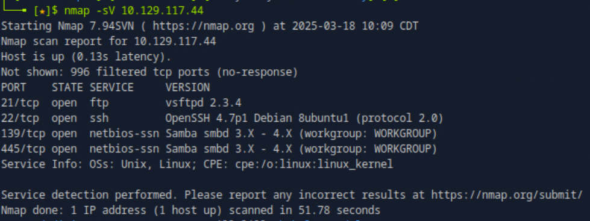
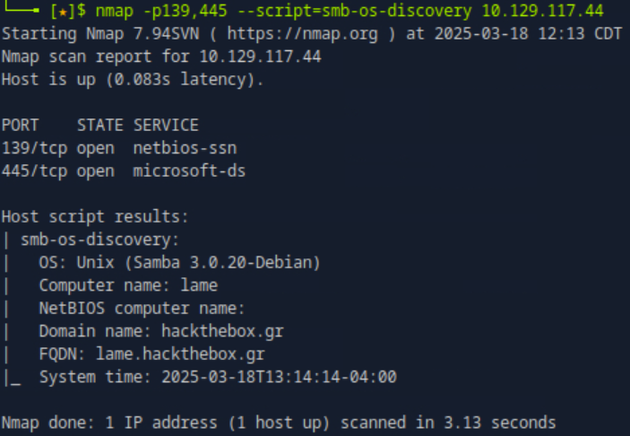
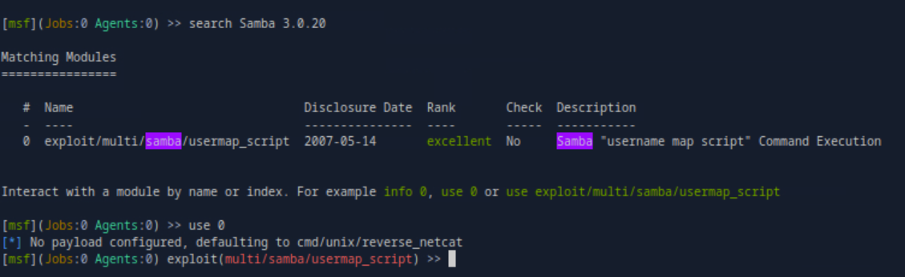
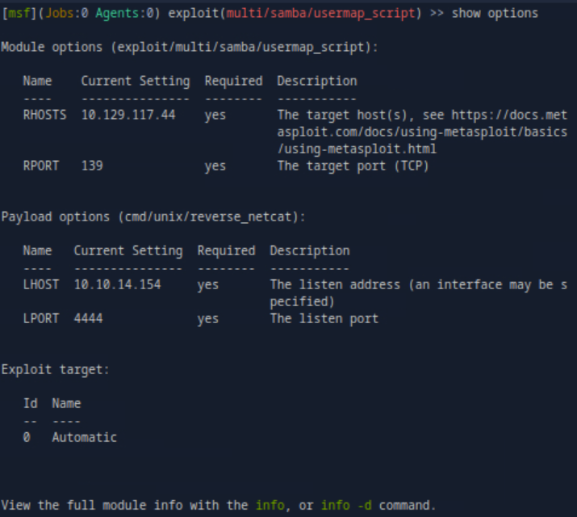
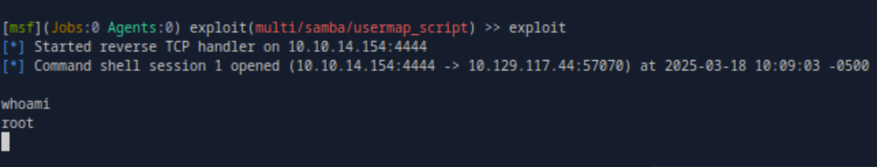
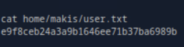
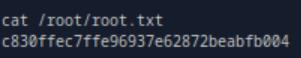

### Lame

**OS:** Linux 
**Difficulty:** Easy  

**Tags:** Vulnerability Assessment, Enterprise Network, Common Services, Security Tools, Software & OS exploitation, Remote Code Execution 

---

#### Choosing an Exploit

Running an Nmap scan, we find that there is ftp, ssh, and smb services running on the target:

Running a further Nmap scan, we find that the smb service is running Samba Version 3.0.20:

Using Metasploit, we find an exploit for Samba Version 3.0.20:

---

#### Exploiting SMB

We use the Metasploit multi/samba/usermap_script exploit. We set the `RHOSTS` option to the Target IP and the `LHOSTS` option to our IP Address:

We run the exploit and are now logged in as the `root` user:

---

#### User Flag
> 795bdbbc97924a7504762134a95b6029

#### Root Flag
> aecfeaf7982bf1a925af0189e4f1d550

---