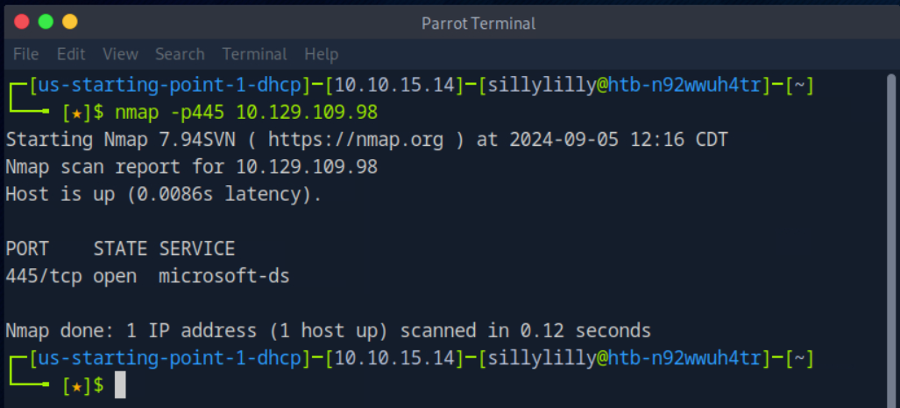
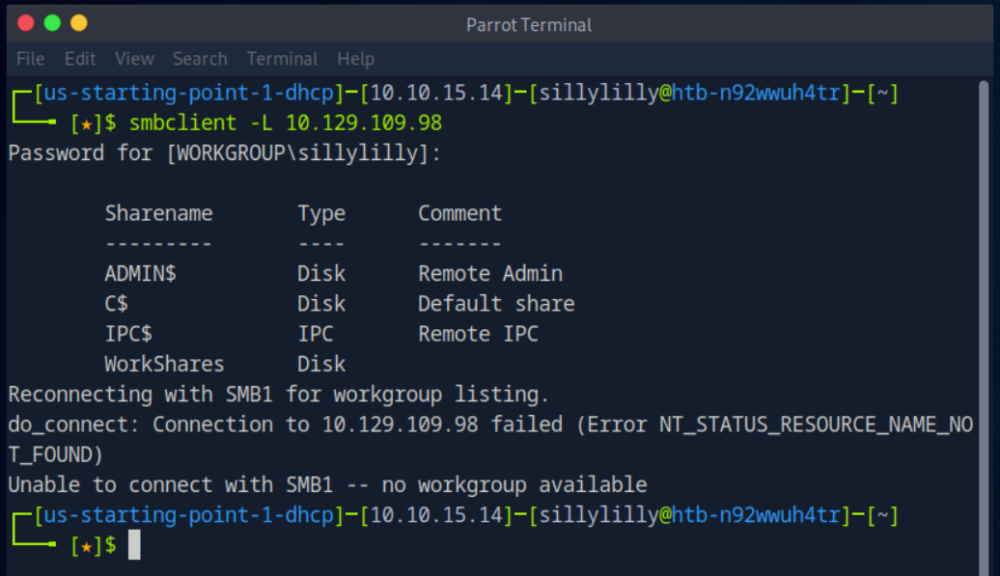
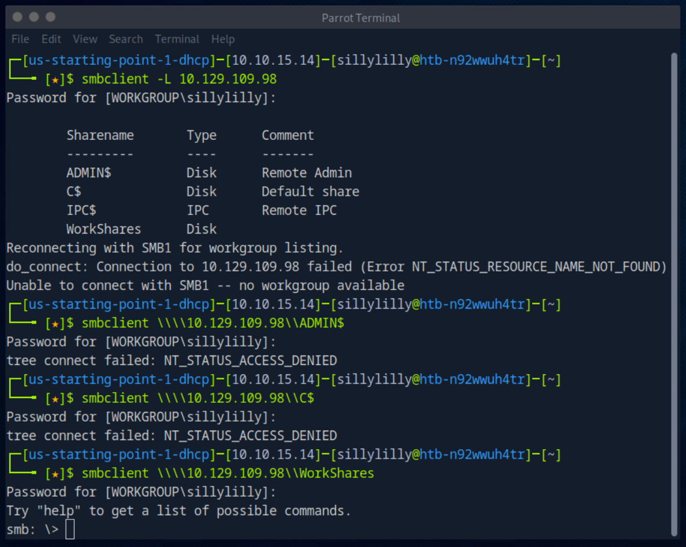
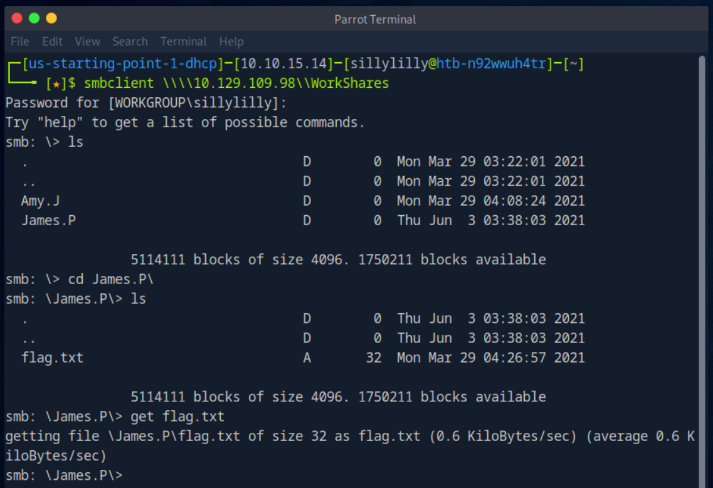
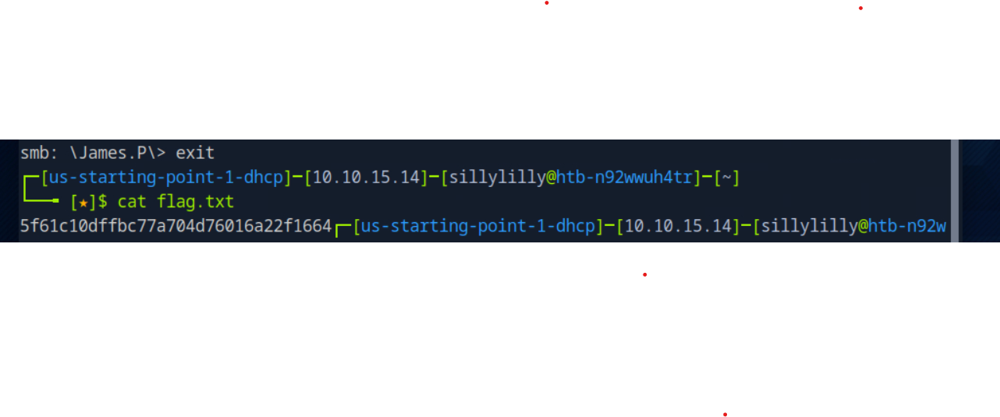

# Dancing Machine

Dancing is a very easy Windows machine on Hack The Box Starting Point Tier 0 that focuses on exploiting an SMB misconfiguration.

## Task 1

**What does the 3-letter acronym SMB stand for?**

> Server Message Block

## Task 2

**What port does SMB use to operate at?**

> 445

## Task 3

**What is the service name for port 445 that came up in our Nmap scan?**

> microsoft-ds

## Task 4

**What is the 'flag' or 'switch' that we can use with the smbclient utility to 'list' the available shares on Dancing?**

> -L

## Task 5

**How many shares are there on Dancing?**

> 4

## Task 6

**What is the name of the share we are able to access in the end with a blank password?**

> WorkShares

We try accessing every share using a blank password except `IPC$`. We find that `WorkShares` is accessible with a blank password.

## Task 7

**What is the command we can use within the SMB shell to download the files we find?**

> get

We use the `get` command in the SMB shell to download the `flag.txt` file.

## Flag

> 5f61c10dffbc77a704d76016a22f1664

We exit the SMB shell and then use the `cat` command to view the contents of `flag.txt`.

