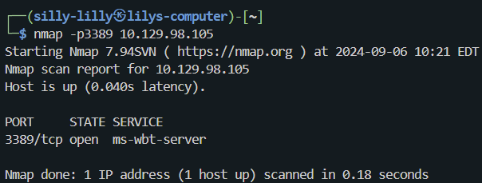
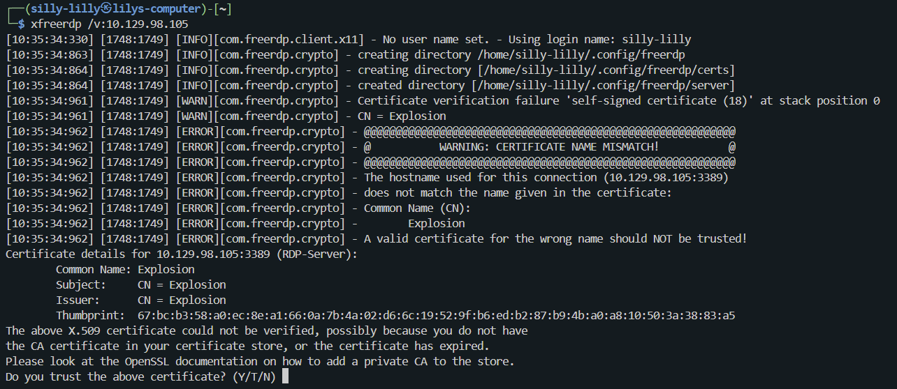
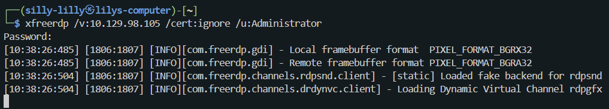
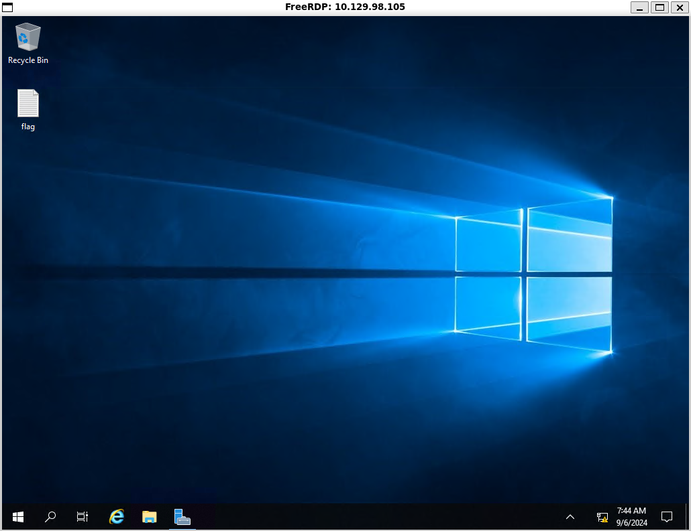
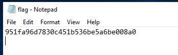

### Explosion
**OS:** Windows 
**Difficulty:** Very Easy 
**Collection:** [Starting Point Tier 0](/StartingPoint/Tier0/)  

**Tags:** Programming, RDP, Reconnaissance, Weak Credentials 

---

#### Task 1

**What does the 3-letter acronym RDP stand for?**

> remote desktop protocol

---

#### Task 2

**What is a 3-letter acronym that refers to interaction with the host through a command line interface?**

> cli

---

#### Task 3

**What about graphical user interface interactions?**

> gui

---

#### Task 4

**What is the name of an old remote access tool that came without encryption by default and listens on TCP port 23?**

> telnet

---

#### Task 5

**What is the name of the service running on port 3389 TCP?**

> ms-wbt-server

---

#### Task 6

**What is the switch used to specify the target host's IP address when using xfreerdp?**

> /v:

---

#### Task 7

**What username successfully returns a desktop projection to us with a blank password?**

> Administrator

We try default accounts with the `/cert:ignore` switch and find that the `Administrator` can login with a blank password.

---

#### Flag

> 951fa96d7830c451b536be5a6be008a0

Once we login with the `Administrator` username, we see a desktop projection.

On the desktop projection, we find and open a file named `flag`.

---