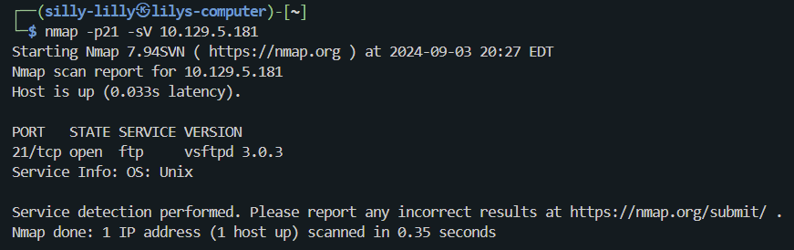

# Fawn Machine

Fawn is a very easy linux machine on Hack The Box Starting Point Tier 0 that focuses on Nmap scanning and FTP.

## Task 1

**What does the 3-letter acronym FTP stand for?**

> file transfer protocol

## Task 2

**Which port does the FTP service listen on usually?**

> 21

## Task 3

**FTP sends data in the clear, without any encryption. What acronym is used for a later protocol designed to provide similar functionality to FTP but securely, as an extension of the SSH protocol?**

> sftp

## Task 4

**What is the command we can use to send an ICMP echo request to test our connection to the target?**

> ping

## Task 5

**From your scans, what version is FTP running on the target?**

> vsftpd 3.0.3

## Task 6

**From your scans, what OS type is running on the target?**

> Unix

## Task 7

**What is the command we need to run in order to display the 'ftp' client help menu?**

> ftp -h

## Task 8

**What is username that is used over FTP when you want to log in without having an account?**

> anonymous

## Task 9

**What is the response code we get for the FTP message 'Login successful'?**

> 230

## Task 10

**There are a couple of commands we can use to list the files and directories available on the FTP server. One is dir. What is the other that is a common way to list files on a Linux system.**

> ls

## Task 11

**What is the command used to download the file we found on the FTP server?**

> get

We use the command `ftp 10.129.5.181` to login to the FTP server with username `anonymous` and a blank password. We use the command `get flag.txt' to download the `flag.txt` file.

## Flag

> 035db21c881520061c53e0536e44f815

