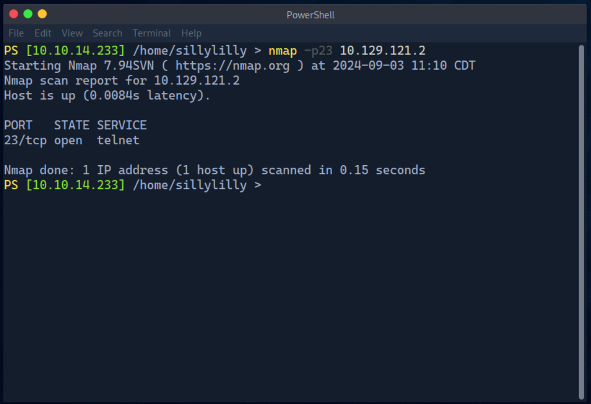
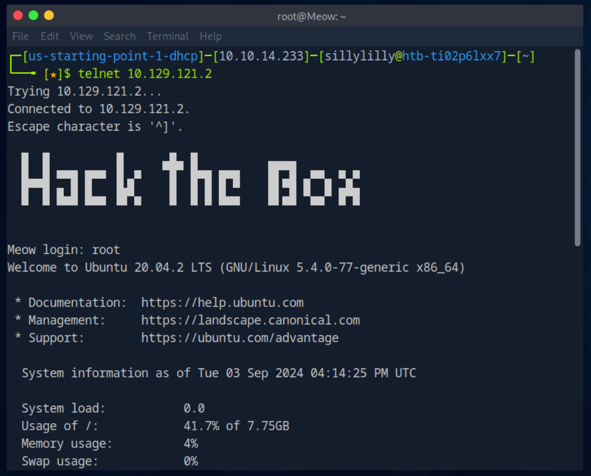
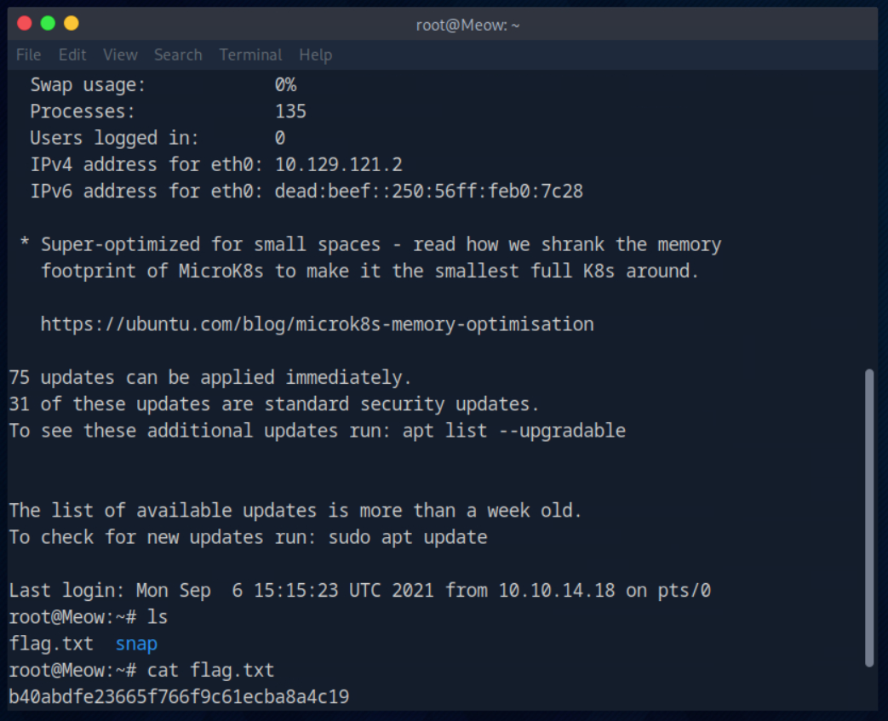

# Meow Machine

Meow is a very easy linux machine on Hack The Box Starting Point Tier 0 that focuses on port scanning using Nmap, password guessing, and logging into Telnet.

## Task 1

**What does the acronym VM stand for?**

> Virtual Machine

## Task 2

**What tool do we use to interact with the operating system in order to issue commands via the command line, such as the one to start our VPN connection? It's also known as a console or shell.**

> terminal

## Task 3

**What service do we use to form our VPN connection into HTB labs?**

> openvpn

## Task 4

**What tool do we use to test our connection to the target with an ICMP echo request?**

> ping

## Task 5

**What is the name of the most common tool for finding open ports on a target?**

> nmap

## Task 6

**What service do we identify on port 23/tcp during our scans?**

> telnet

## Task 7

**What username is able to log into the target over telnet with a blank password?**

> root

We try default and common usernames until we find that the username `root` is able to log in with a blank password.

## Flag

> b40abdfe23665f766f9c61ecba8a4c19

Once we login to telnet as root, we use the command `ls` and see that there is a `flag.txt` file. Lastly, we use the command `cat flag.txt` to view the contents of the file.

