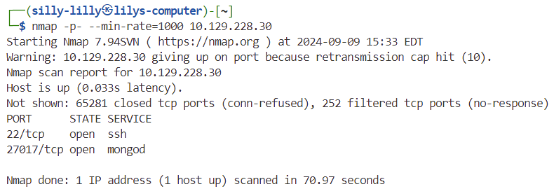
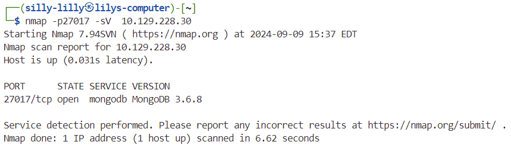
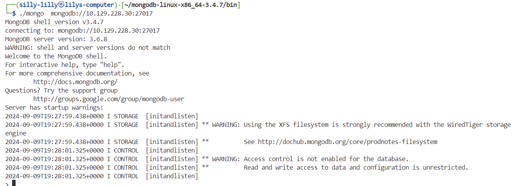
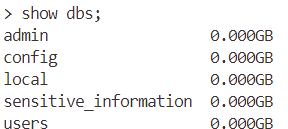
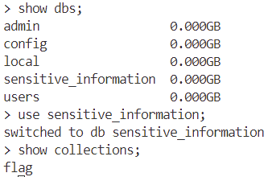
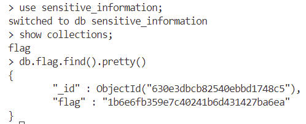

# Mongod Machine

Mongod is a very easy linux machine on Hack The Box Starting Point Tier 0 that focuses on exploiting a MongoDB misconfiguration.

## Task 1

**How many TCP ports are open on the machine?**

> 2

We use nmap with the `-p-` flag to scan all tcp ports. We add the `--min-rate=1000` flag  to speed up our scan.

## Task 2

**Which service is running on port 27017 of the remote host?**

> MongoDB 3.6.8

We use nmap with the `-p27017` flag to scan port 27017 and the `-sV` flag to get the service and version.

## Task 3

**What type of database is MongoDB? (Choose: SQL or NoSQL)**

> NoSQL

## Task 4

**What is the command name for the Mongo shell that is installed with the mongodb-clients package?**

> mongo

We use the `mongo` command to connect to the MongoDB server running on port `27017` of the host `10.129.228.30`.

## Task 5

**What is the command used for listing all the databases present on the MongoDB server? (No need to include a trailing ;)**

> show dbs

## Task 6

**What is the command used for listing out the collections in a database? (No need to include a trailing ;)**

> show collections

We use the `use` command to select the `sensitive_information` database. Then we use the `show collections;` command to list collections in the `sensitive_information` database.

## Task 7

**What is the command used for dumping the content of all the documents within the collection named flag in a format that is easy to read?**

> db.flag.find().pretty()

## Flag

> 1b6e6fb359e7c40241b6d431427ba6ea
