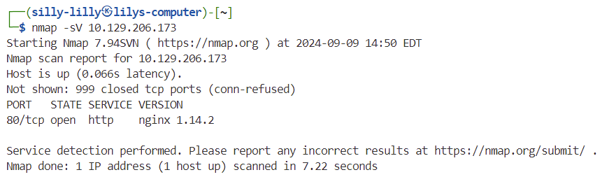
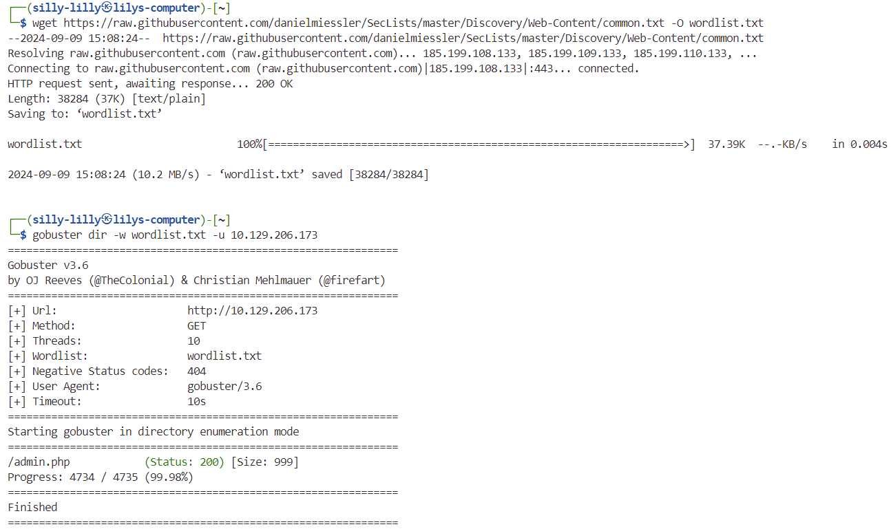
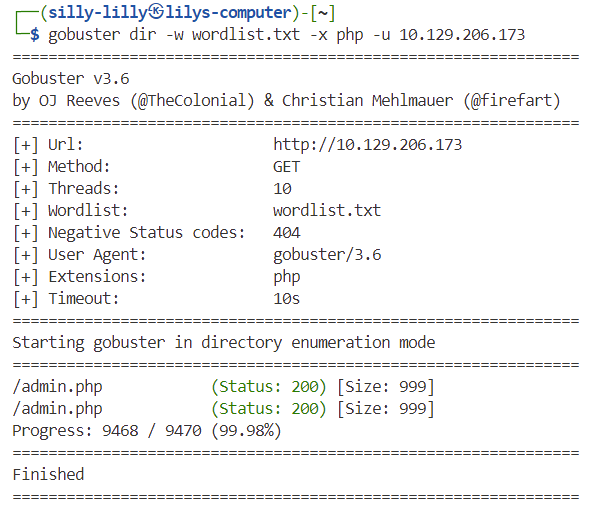
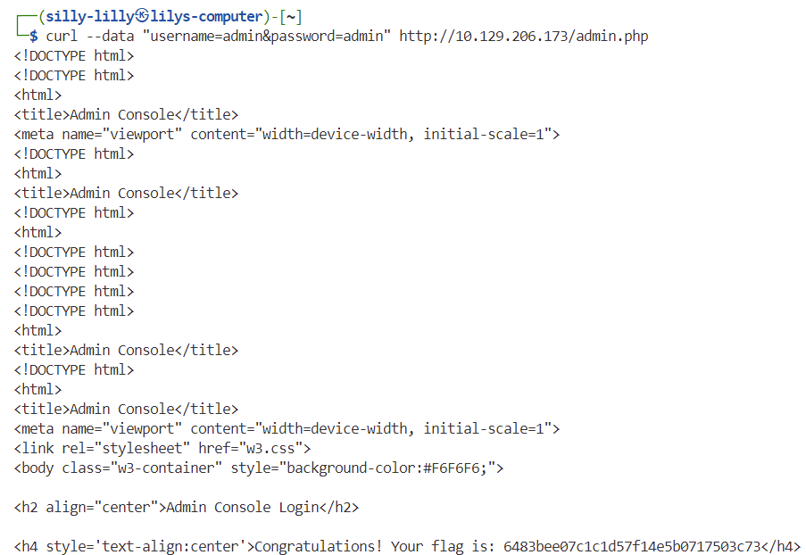

# Preignition Machine

Preignition is a very easy linux machine on Hack The Box Starting Point Tier 0 that focuses on dir busting using Gobuster.

## Task 1

**Directory Brute-forcing is a technique used to check a lot of paths on a web server to find hidden pages. Which is another name for this? (i) Local File Inclusion, (ii) dir busting, (iii) hash cracking.**

> dir busting

## Task 2

**What switch do we use for nmap's scan to specify that we want to perform version detection**

> -sV

## Task 3

**What does Nmap report is the service identified as running on port 80/tcp?**

> http

## Task 4

**What server name and version of service is running on port 80/tcp?**

> nginx 1.14.2

## Task 5

**What switch do we use to specify to Gobuster we want to perform dir busting specifically?**

> dir

First we download the [common.txt wordlist](https://raw.githubusercontent.com/danielmiessler/SecLists/master/Discovery/Web-Content/common.txt) as a file named `wordlist.txt`. Then we include the path to our downloaded wordlist using the switch `-w wordlist.txt`.

## Task 6

**When using gobuster to dir bust, what switch do we add to make sure it finds PHP pages?**

> -x php

Using our `wordlist.txt` file that we download above, we also specify the `-x php` switch.

## Task 7

**What page is found during our dir busting activities?**

> admin.php

## Task 8

**What is the HTTP status code reported by Gobuster for the discovered page?**

> 200

## Flag

> 06483bee07c1c1d57f14e5b0717503c73

We make a post request using the `curl` command with the username and password fields both set to `admin`.

