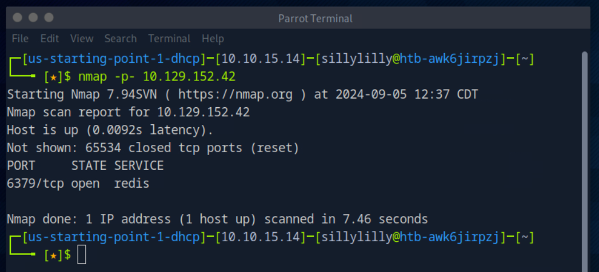
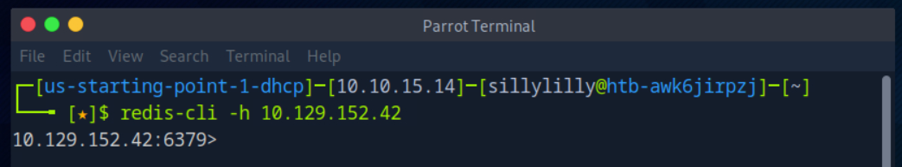
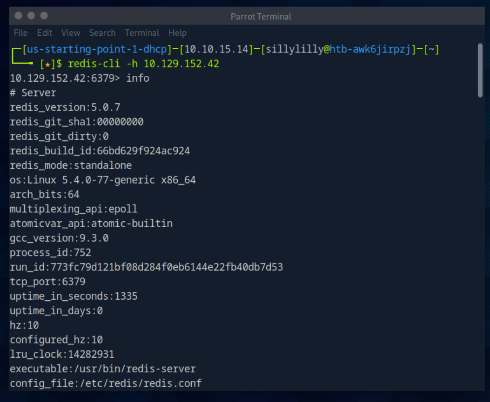
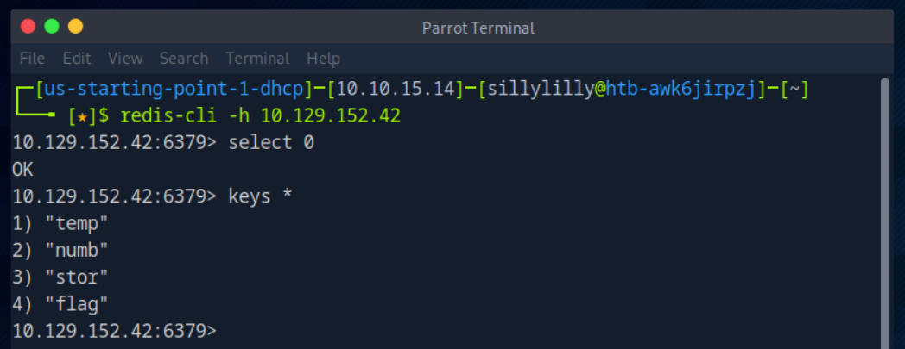
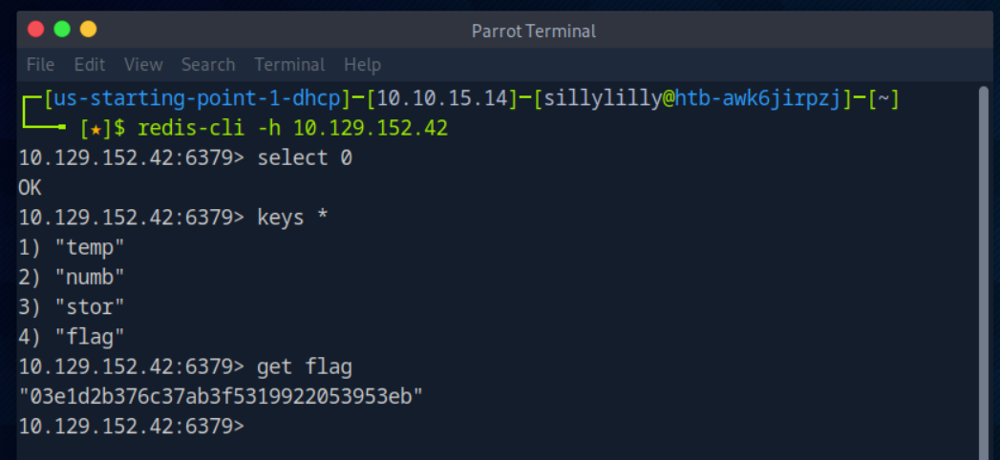

### Redeemer

**OS:** Linux 
**Difficulty:** Very Easy 
**Collection:** [Starting Point Tier 0](/StartingPoint/Tier0/) 
**Tags:** Redis, Vulnerability Assessment, Databases, Reconnaissance, Anonymous/Guest Access 

---

#### Task 1

**Which TCP port is open on the machine?**

> 6379

We use the `nmap` command with the `-p-` flag to scan every port on the machine.

---

#### Task 2

**Which service is running on the port that is open on the machine?**

> redis

---

#### Task 3

**What type of database is Redis? Choose from the following options: (i) In-memory Database, (ii) Traditional Database**

> In-memory Database

---

#### Task 4

**Which command-line utility is used to interact with the Redis server? Enter the program name you would enter into the terminal without any arguments.**

> redis-cli

---

#### Task 5

**Which flag is used with the Redis command-line utility to specify the hostname?**

> -h

We use the `redis-cli` command with the `-h` flag to connect to the redis server with hostname `10.129.152.42`.

---

#### Task 6

**Once connected to a Redis server, which command is used to obtain the information and statistics about the Redis server?**

> info

---

#### Task 7

**What is the version of the Redis server being used on the target machine?**

> 5.0.7

---

#### Task 8

**How many keys are present inside the database with index 0?**

> 4

We use the `select 0` command to choose the database with index 0. Then we use the `keys *` command to see that there is 4 keys inside the database.

---

#### Flag

> 03e1d2b376c37ab3f5319922053953eb

We use the `get` command to view the value of the flag key.

---