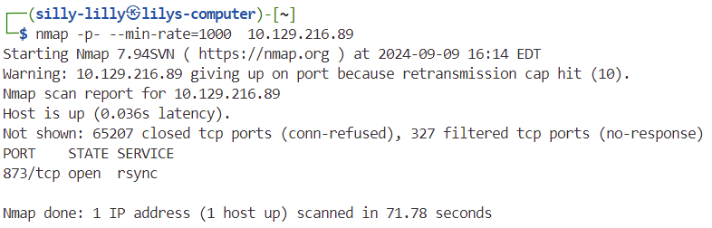
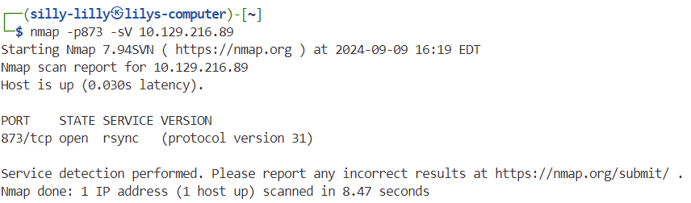
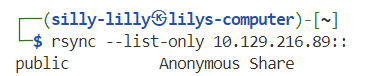
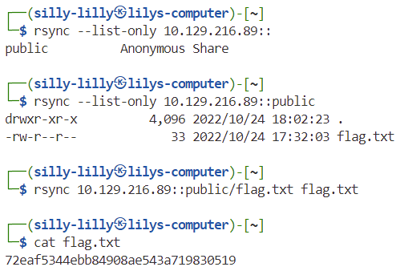

# Synced Machine

Synced is a very easy linux machine on Hack The Box Starting Point Tier 0 that focuses on connecting to rsync anonymously.

## Task 1

**What is the default port for rsync?**

> 873

## Task 2

**How many TCP ports are open on the remote host?**

> 1

We use nmap with the `-p-` flag to scan all tcp ports. We add the `--min-rate=1000` flag  to speed up our scan.

## Task 3

**What is the protocol version used by rsync on the remote machine?**

> 31

We use nmap with the `-p` flag to scan port `873`. We add the `-sV` flag  to get the protocol version.

## Task 4

**What is the most common command name on Linux to interact with rsync?**

> rsync

## Task 5

**What credentials do you have to pass to rsync in order to use anonymous authentication? anonymous:anonymous, anonymous, None, rsync:rsync**

> None

We can use anonymous authentication to connect to rsync and list shares and files by passing no credentials.

# Task 6

**What is the option to only list shares and files on rsync? (No need to include the leading -- characters)**

> list-only

## Flag

> 72eaf5344ebb84908ae543a719830519

First we list the all the available directories using the `rsync --list-only 10.129.216.89::` command. We see that there is a public directory and list the files in it using the `rsync --list-only 10.129.216.89::public` command. We see that there is a file called `flag.txt` in the public directory and download it using the `rsync 10.129.216.89::public/flag.txt flag.txt` command. Lastly, we use `cat flag.txt` to view the contents of the `flag.txt` file.

