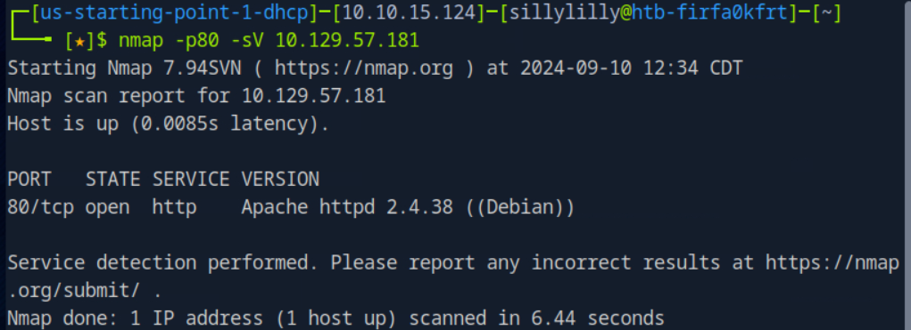
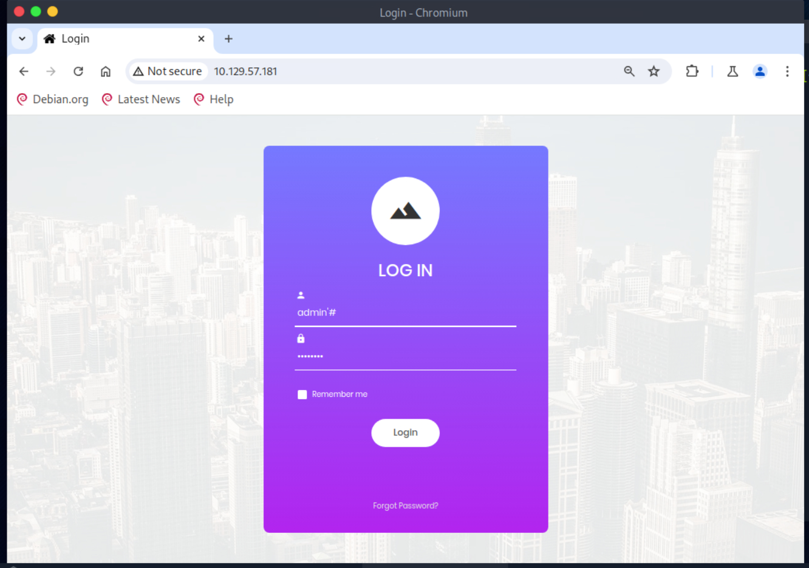
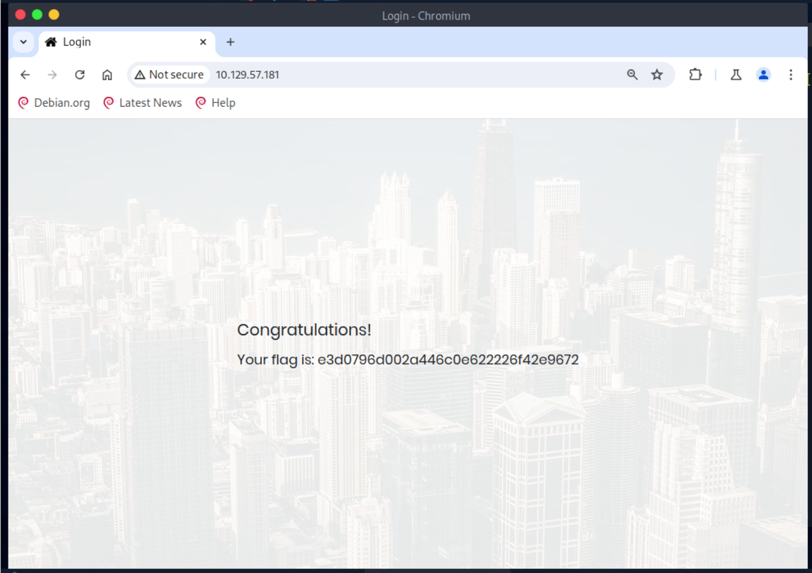

# Appointment Machine

Appointment Machine is a very easy linux machine on Hack The Box Starting Point Tier 1 that focuses on  SQLi.

## Task 1

**What does the acronym SQL stand for?**

> Structured Query Language

## Task 2

**What is one of the most common type of SQL vulnerabilities?**

> SQL Injection

## Task 3

**What is the 2021 OWASP Top 10 classification for this vulnerability?**

> A03:2021-Injection

## Task 4

**What does Nmap report as the service and version that are running on port 80 of the target?**

> Apache httpd 2.4.38 ((Debian))



## Task 5

**What is the standard port used for the HTTPS protocol?**

> 443

## Task 6

**What is a folder called in web-application terminology?**

> directory

## Task 7

**What is the HTTP response code is given for 'Not Found' errors?**

> 404

## Task 8

**Gobuster is one tool used to brute force directories on a webserver. What switch do we use with Gobuster to specify we're looking to discover directories, and not subdomains?**

> dir

## Task 9

**What single character can be used to comment out the rest of a line in MySQL?**

> \#

## Task 10

**If user input is not handled carefully, it could be interpreted as a comment. Use a comment to login as admin without knowing the password. What is the first word on the webpage returned?**

> Congratulations

The login page asks users to input a username and password. We assume the website uses a SQL statement to select a user (from a database of users) where both the user inputted username and password match the database entry's username and password:

```SQL
SELECT * FROM users WHERE username='$username' AND password='$password
```

We use the username `admin'#` with an arbitrary password to login as `admin` without the password.



By using the username `admin'#`, the SQL statement selects a user where the username is `admin` without checking if the user inputted password matches the password in the database entry.

```SQL
SELECT * FROM users WHERE username='admin'#' AND password='$password
```



## Flag

> e3d0796d002a446c0e622226f42e9672
