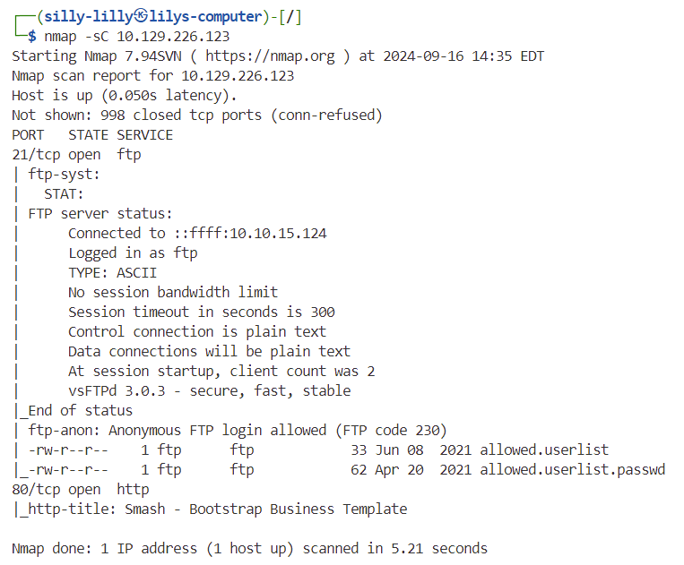
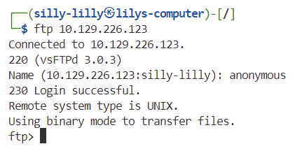
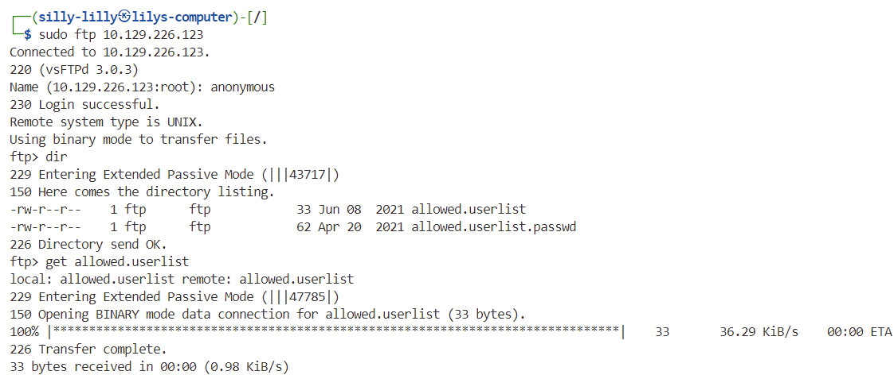
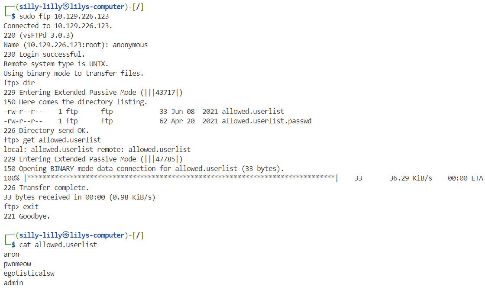
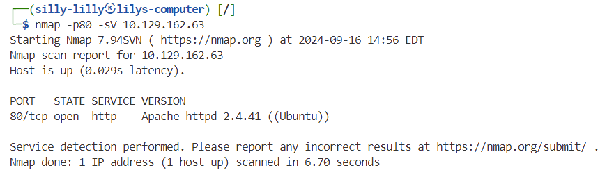
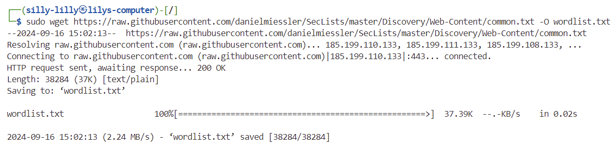
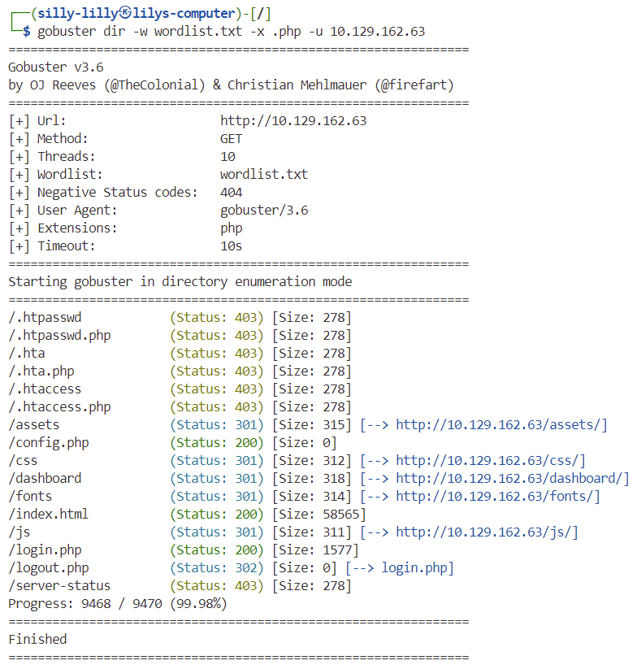
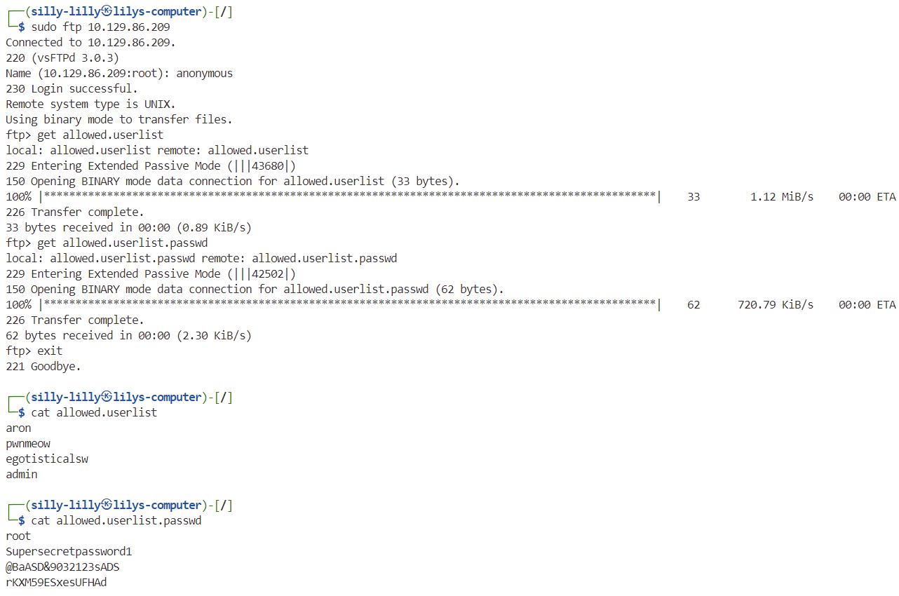
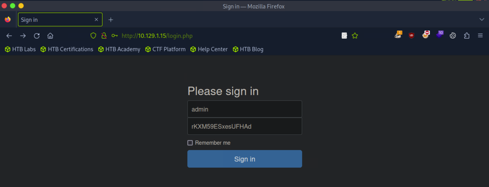
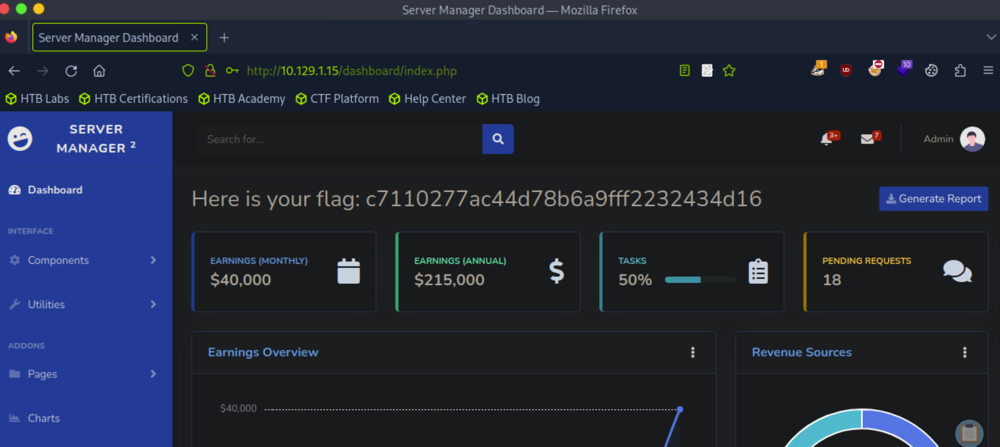

# Crocodile

Crocodile is a very easy linux machine on Hack The Box Starting Point Tier 1 that focuses on exploiting FTP misconfigurations to steal user credentials and using Gobuster to discover web pages.

## Task 1

**What Nmap scanning switch employs the use of default scripts during a scan?**

> -sC

## Task 2

**What service version is found to be running on port 21?**

> vsftpd 3.0.3

## Task 3

**What FTP code is returned to us for the "Anonymous FTP login allowed" message?**

> 230

## Task 4

**After connecting to the FTP server using the ftp client, what username do we provide when prompted to log in anonymously?**

> anonymous

## Task 5

**After connecting to the FTP server anonymously, what command can we use to download the files we find on the FTP server?**

> get

We use the `get` command to download the `allowed.userlist` file:

## Task 6

**What is one of the higher-privilege sounding usernames in 'allowed.userlist' that we download from the FTP server?**

> admin

We login to the ftp server and download the `allowed.userlist` file using the `get` command. Then we exit the ftp server and use the `cat` command to view contents of `allowed.userlist`.

## Task 7

**What version of Apache HTTP Server is running on the target host?**

> Apache httpd 2.4.41D

## Task 8

**What switch can we use with Gobuster to specify we are looking for specific filetypes?**

> -x

First we download the [common.txt wordlist](https://raw.githubusercontent.com/danielmiessler/SecLists/master/Discovery/Web-Content/common.txt) as a file named `wordlist.txt`.

Then we use Gobuster in directory/file enumeration mode with the wordlist set to local file `wordlist.txt`, the target set to the target machine's IP address, and the `-x .php` switch to search for files with the `.php` extension:

## Task 9

**Which PHP file can we identify with directory brute force that will provide the opportunity to authenticate to the web service?**

> login.php

## Flag

> c7110277ac44d78b6a9fff2232434d16

First we need to get the login credentials from the ftp server. We login to the ftp server anonymously and use the `get` command to download the `allowed.userlist` and `allowed.userlist.passwd` files. After exiting the ftp server, we use the `cat` command to view the contents of `allowed.userlist` and `allowed.userlist.passwd`.

Then we go to the login page at `http://{target IP}/login.php` and try every username and password pair from `allowed.userlist` and `allowed.userlist.passwd`. We find that we can login with username `admin` and password `rKXM59ESxesUFHAd`.

We login to the `admin` account and see the flag:

