### Funnel

**OS:** Linux<br>
**Difficulty:** Very Easy<br>
**Collection:** [Starting Point Tier 1](/StartingPoint/Tier1/)<br>
**Tags:** FTP, PostgreSQL, Reconnaissance, Tunneling, Password Spraying, Port Forwarding, Anonymous/Guest Access, Clear Text Credentials<br>


---

#### Task 1

**How many TCP ports are open?**

> 2

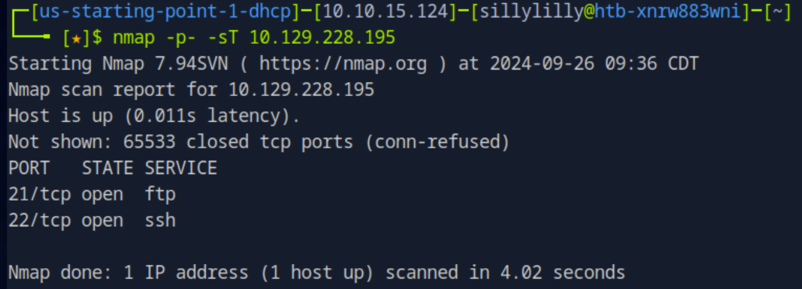


---

#### Task 2

**What is the name of the directory that is available on the FTP server?**

> mail_backup

First we log into the ftp server with the username `anonymous` and a blank password. Next we use the `ls` command to list the server's files and directories.

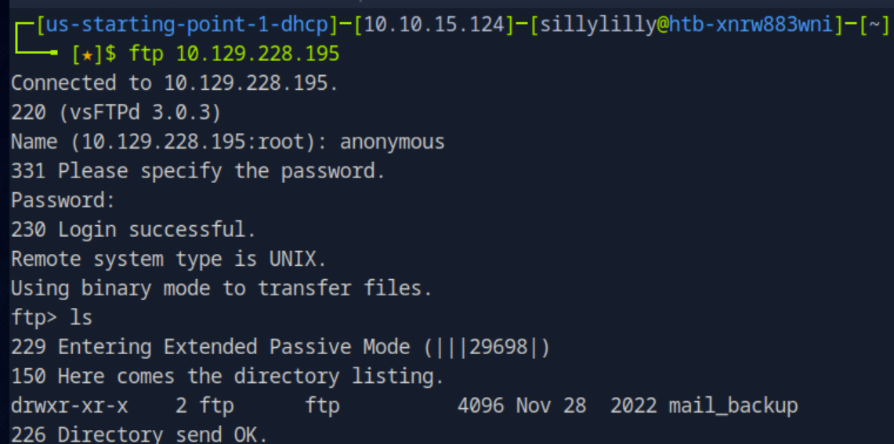


---

#### Task 3

**What is the default account password that every new member on the "Funnel" team should change as soon as possible?**

> funnel123#!#

First we use the `cd` command change our directory to `mail_backup` on the FTP server. Next we use the `ls` command and see that there is a `password_policy.pdf` file on the FTP server. Then we use the `get` command to download the `password_policy.pdf` file to our own computer.

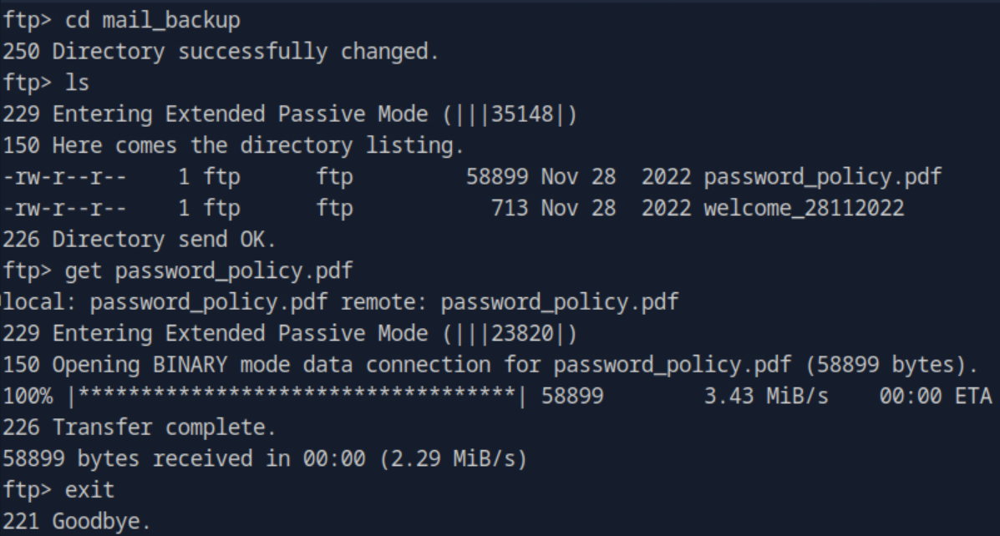

Once we exit the FTP server, we have access to the `password_policy.pdf` that we downloaded from the FTP server. We use the `pdftotext password_policy.pdf` command to convert `password_policy.pdf` file into a `txt` file. Then we use the `cat` command to view our converted file `password_policy.txt`:

```
Password Policy 🔐
Overview
Passwords are a key part of our cyber security strategy. The purpose of this policy
is to make sure all resources and data receive adequate password protection. We
cannot overstate the importance of following a secure password policy and
therefore have provided this document for your guidance. The policy covers all
users who are responsible for one or more account or have access to any resource
that requires a password.

ffi

ffi

Password Creation:
• All passwords should be su ciently complex and therefore di cult for anyone to
guess.
• In addition, employees should also use common sense when choosing
passwords. They must avoid basic combinations that are easy to crack. For
instance, choices like “password,” “password1” and “Pa$$w0rd” are equally bad
from a security perspective.
• A password should be unique, with meaning only to the user who chooses it.
• In some cases, it will be necessary to change passwords at certain frequencies.
• Default passwords — such as those created for new users — must be changed
as quickly as possible. For example the default password of “funnel123#!#” must
be changed immediately.
```

In `password_policy.txt`, we see that the default password is `funnel123#!#`.


---

#### Task 4

**Which user has not changed their default password yet?**

> christine

We log into the FTP server with the username `anonymous` and a blank password again. Then we change our directory to `mail_backup` and use the `get` command to download the `welcome_28112022` file to our own computer.

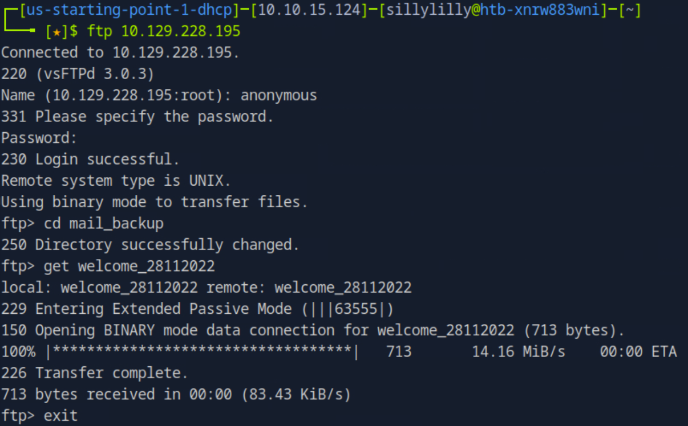

Once we exit the FTP server, we use the `cat` command to view the contents of the `welcome_28112022` file:

```
Frome: root@funnel.htb
To: optimus@funnel.htb albert@funnel.htb andreas@funnel.htb christine@funnel.htb maria@funnel.htb
Subject:Welcome to the team!

Hello everyone,
We would like to welcome you to our team. 
We think you’ll be a great asset to the "Funnel" team and want to make sure you get settled in as smoothly as possible.
We have set up your accounts that you will need to access our internal infrastracture. Please, read through the attached password policy with extreme care.
All the steps mentioned there should be completed as soon as possible. If you have any questions or concerns feel free to reach directly to your manager. 
We hope that you will have an amazing time with us,
The funnel team.
```

The file appears to be an email sent to new employees to notify them that their accounts have been setup. We can look at the email addresses to get usernames for the FTP server:

```
root
optimus
albert
andreas
christine
maria
```

Next we try to log into the FTP server with each of usernames and the password `funnel123#!#`. We find one that we are able to log into the server with the username `christine`:

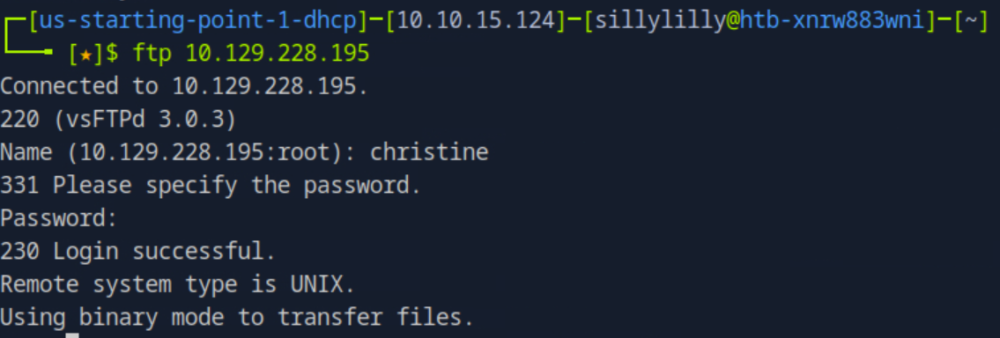


---

#### Task 5

**Which service is running on TCP port 5432 and listens only on localhost?**

> postgresql

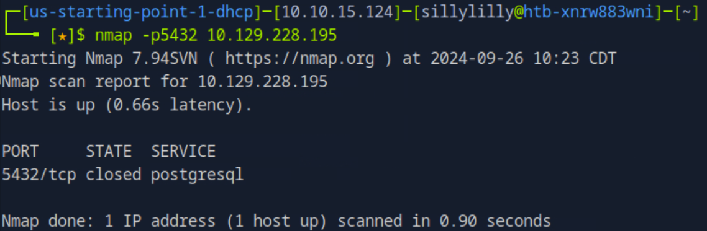


---

#### Task 6

**Since you can't access the previously mentioned service from the local machine, you will have to create a tunnel and connect to it from your machine. What is the correct type of tunneling to use? remote port forwarding or local port forwarding?**

> local port forwarding


---

#### Task 7

**What is the name of the database that holds the flag?**

> secrets

On our computer we set up SSH tunneling. We use local port forwarding to forward a connection from our computer to the target computer. This connection will allow us to interact with the target machine's postgresql database from our own computer. We can use the `ssh` command to setup port forwarding:

```bash
ssh -L [LOCAL_IP:]LOCAL_PORT:DESTINATION:DESTINATION_PORT [USER@]SSH_SERVER
```

We replace `LOCAL_IP` with `localhost` and `LOCAL_PORT` with `12345`. We also replace `SSH_SERVER` with our target machine's IP Address. We replace `DESTINATION` with `localhost` and `DESTINATION_PORT` with `5432`. This allows us to forward traffic from our computer's port `12345` to the target machine's SSH server (port `22`). And then forward traffic from the target machine's SSH server to the target machine's port `5432`:

```bash
ssh -L localhost:12345:localhost:5432 christine@{Target IP}
```

Next while we are SSH Tunneling, we start postgresql on our computer by using the command `sudo su postgres`:

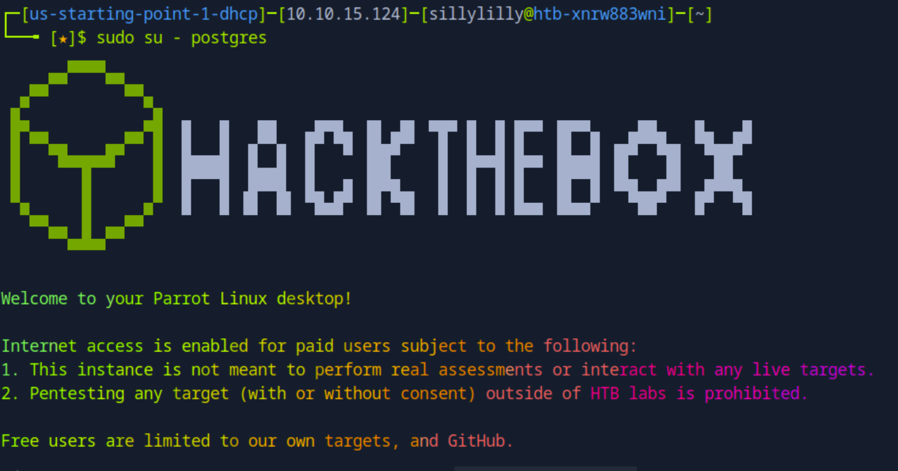

Next we the connect to the target machine's SQL server by setting the host flag to `localhost` and the port to `12345`. We connect as user `christine` with password `funnel123#!#`. This allows us to interact with the SQL server running on port `5432` of the target machine as if the the SQL server was running on our computer's port `12345`:

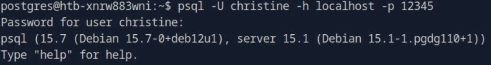

Next we use the `\l` command in our SQL shell to list the server's databases:

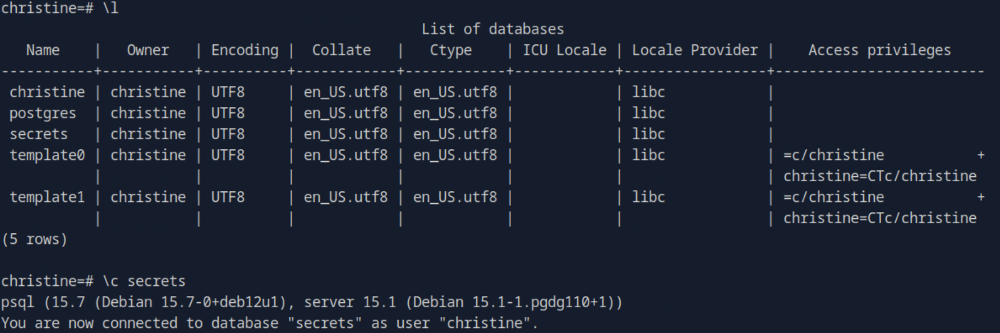

Then we use the `\c` command to choose the database named `secret`. Then we use the `\dt` command to list the tables in the `secret` database. We see that there is a table named `flag`:

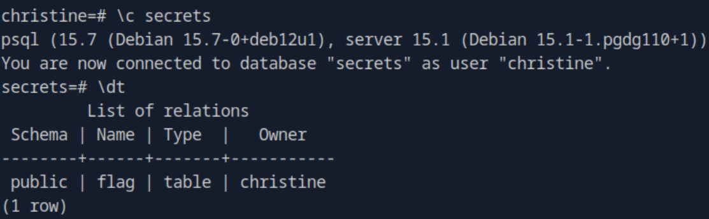


---

#### Task 8

**Could you use a dynamic tunnel instead of local port forwarding? Yes or No.**

> Yes

Dynamic port forwarding would forward a connection from our computer to the target machine and then to the destination host across multiple ports.


---

#### Flag

> cf277664b1771217d7006acdea006db1

In our SQL shell after we choose the `secret` database, we use the `SELECT` command to select every row in the `flag` table:

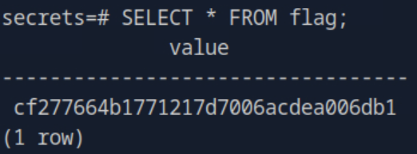


---