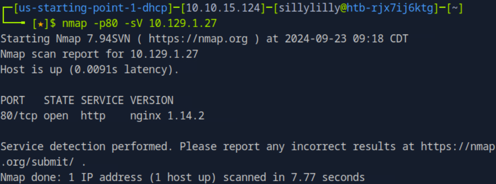
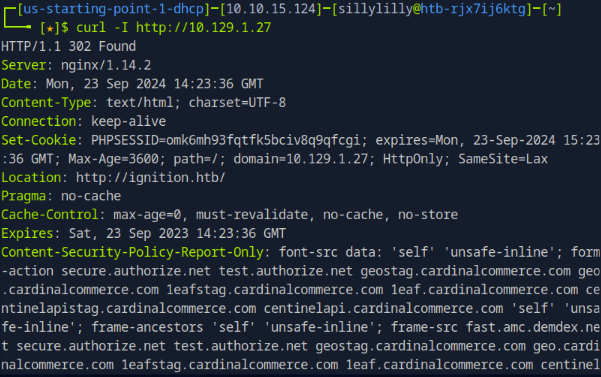
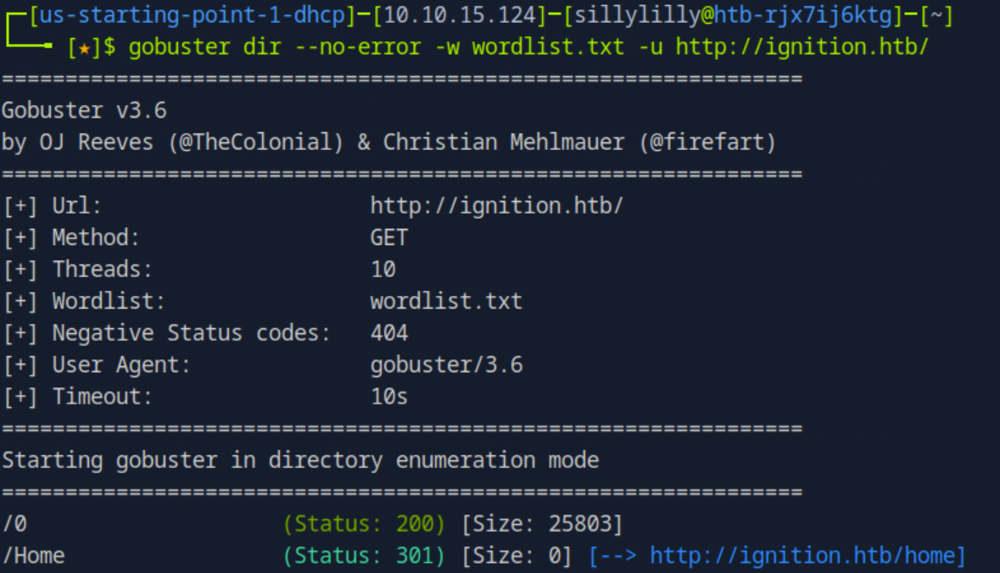
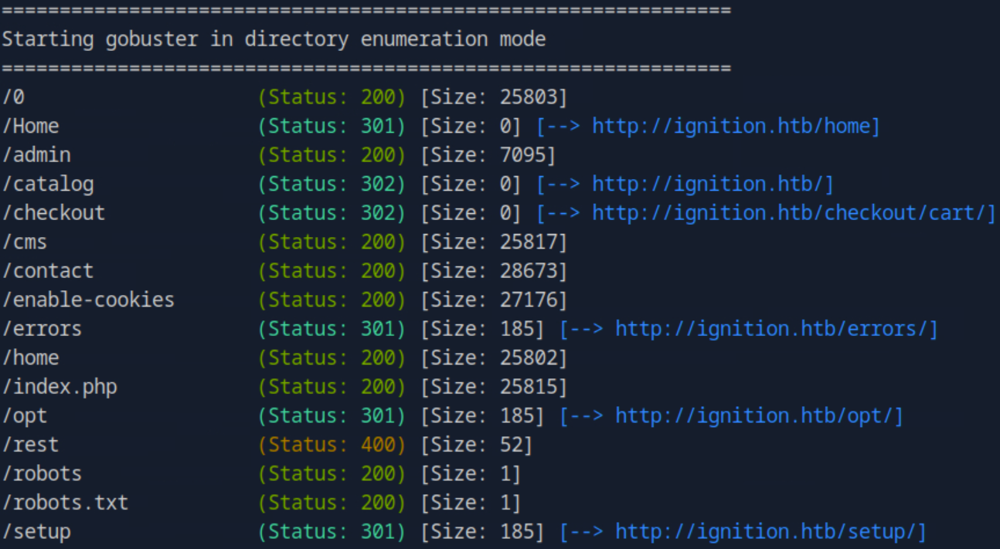
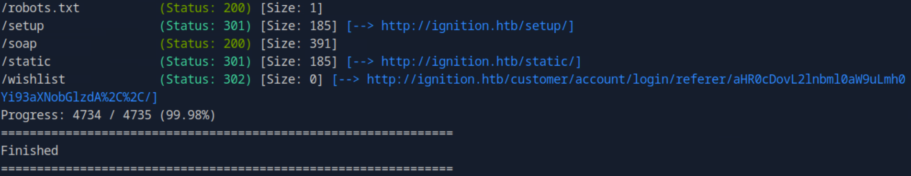
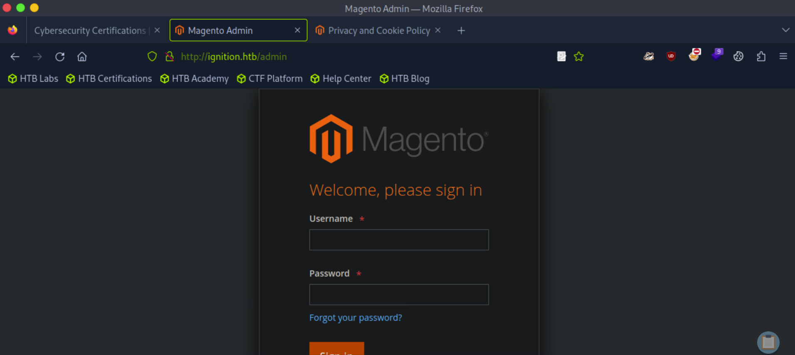
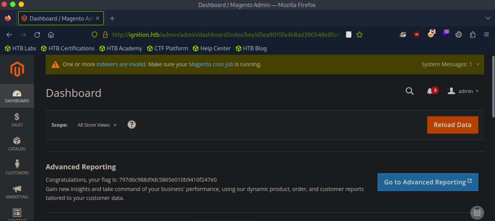

### Ignition

**OS:** Linux<br>
**Difficulty:** Very Easy<br>
**Collection:** [Starting Point Tier 1](/StartingPoint/Tier1/)<br><br>
**Tags:** Common Applications, Magento, Reconnaissance, Web Site Structure Discovery, Weak Credentials<br>


---

#### Task 1

**Which service version is found to be running on port 80?**

> nginx 1.14.2




---

#### Task 2

**What is the 3-digit HTTP status code returned when you visit http://{machine IP}/?**

> 302

We use the `nmap` command with the `-I` flag to get the HTP response headers.




---

#### Task 3

**What is the virtual host name the webpage expects to be accessed by?**

> ignition.htb


---

#### Task 4

**What is the full path to the file on a Linux computer that holds a local list of domain name to IP address pairs?**

> /etc/hosts

We add the domain name and IP address pair of the challenge website to the `/etc/hosts` file using the command :

```bash
sudo bash -c "echo 10.129.1.27 ignition.htb >> /etc/hosts"
```


---

#### Task 5

**Use a tool to brute force directories on the webserver. What is the full URL to the Magento login page?**

> http://ignition.htb/admin

First we use the `wget` command to download the [common.txt wordlist](https://raw.githubusercontent.com/danielmiessler/SecLists/master/Discovery/Web-Content/common.txt). We use gobuster with our downloaded wordlist in dirbusting mode to find directories and pages on the webserver.





Then going to `http://ignition.htb/admin` we see the Magento login page:




---

#### Task 6

**Look up the password requirements for Magento and also try searching for the most common passwords of 2023. Which password provides access to the admin account?**

> qwerty123

We [find](https://magento.stackexchange.com/questions/216328/magento-2-admin-password-customization) that the default password requirements for Magento are:

- Passwords need to be at least 7 characters
- Passwords need to contain a letter and a number

Now we use [Cyber New's List of Most Used Passwords](https://cybernews.com/best-password-managers/most-common-passwords/):

- 123456
- 123456789
- qwerty
- password
- 12345
- qwerty123
- 1q2w3e
- 12345678
- 111111
- 1234567890

The only password that meets the above requirements is `qwerty123`.


---

#### Flag

> 797d6c988d9dc5865e010b9410f247e0

After logging in with Username `admin` and password `qwerty`, we find the flag:



---