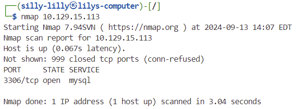
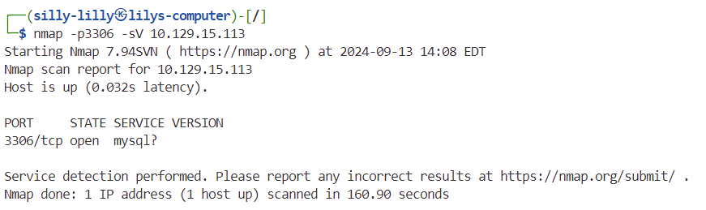
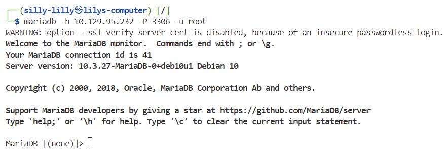
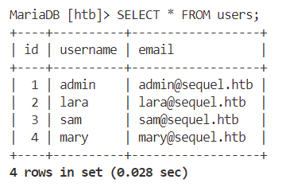
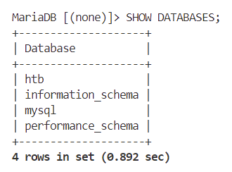
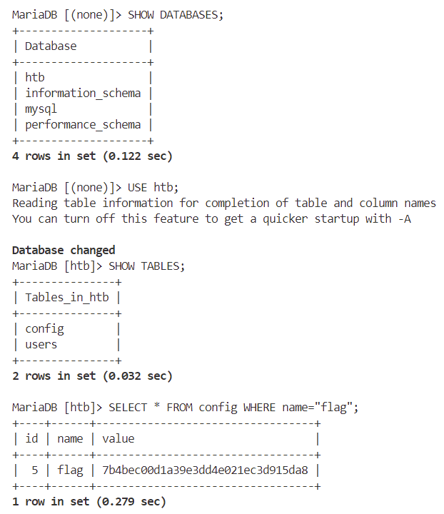

### Sequel

**OS:** Linux 
**Difficulty:** Very Easy 
**Collection:** [Starting Point Tier 1](/StartingPoint/Tier1/)  
**Tags:** Vulnerability Assessment, Databases, MySQL, SQL, Reconnaissance, Weak Credentials 

---

#### Task 1

**During our scan, which port do we find serving MySQL?**

> 3306

---

#### Task 2

**What community-developed MySQL version is the target running?**

> MariaDB

---

#### Task 3

**When using the MySQL command line client, what switch do we need to use in order to specify a login username?**

> -u

---

#### Task 4

**Which username allows us to log into this MariaDB instance without providing a password?**

> root

---

#### Task 5

**In SQL, what symbol can we use to specify within the query that we want to display everything inside a table?**

> \*

Showing everything in the `users` table:

---

#### Task 6

**In SQL, what symbol do we need to end each query with?**

> ;

---

#### Task 7

**There are three databases in this MySQL instance that are common across all MySQL instances. What is the name of the fourth that's unique to this host?**

> htb

We use the command `SHOW DATABASES` to show all databases and see that the `htb` database is the one that is unique to this host:

---

#### Flag

> 7b4bec00d1a39e3dd4e021ec3d915da8

After logging in, we choose the `htb` database. Then we select rows from the `config` table where the name has value `flag`:

---