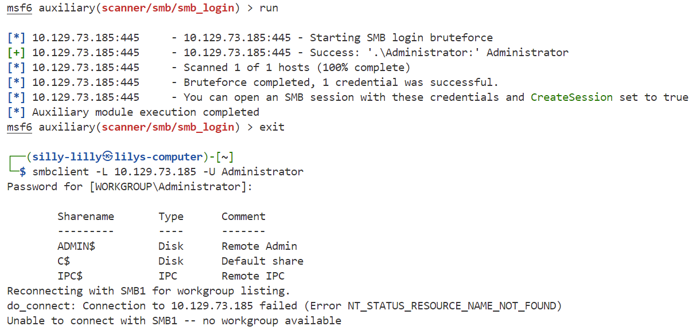

### Tactics

**OS:** Windows 
**Difficulty:** Very Easy 
**Collection:** [Starting Point Tier 1](/StartingPoint/Tier1/)  
**Tags:** Protocols, SMB, Reconnaissance, Misconfiguration 

---

#### Task 1

**Which Nmap switch can we use to enumerate machines when our ping ICMP packets are blocked by the Windows firewall?**

> -Pn

---

#### Task 2

**What does the 3-letter acronym SMB stand for?**

> server message block

---

#### Task 3

**What port does SMB use to operate at?**

> 445

---

#### Task 4

**What command line argument do you give to `smbclient` to list available shares?**

> -L

We try logging into the SMB Server without a password, but cannot:

We use Metasploit to brute force login credentials. We try logging into the built-in Windows Administrator account using Metasploit's `use auxiliary/scanner/smb/smb_login` module using the [common password list](https://raw.githubusercontent.com/danielmiessler/SecLists/refs/heads/master/Passwords/Common-Credentials/10-million-password-list-top-100.txt). We set `ANONYMOUS_LOGIN` and `BLANK_PASSWORDS` to `true`, `PASS_FILE` to our downloaded `passwords.txt` wordlist, `RHOSTS` to our target IP, and `SMBUser` to `Administrator`:

We find that we can log into the SMB server with the username `Administrator` and a blank password. We give the `-L` argument with the `smbclient` to list available shares:

---

#### Task 5

**What character at the end of a share name indicates it's an administrative share?**

> $

---

#### Task 6

**Which Administrative share is accessible on the box that allows users to view the whole file system?**

> C$

---

#### Task 7

**What command can we use to download the files we find on the SMB Share?**

> get

We can use the `-c` to execute the command `get Users\Administrator\Desktop\flag.txt`. Next we use the `cat` command to view the flag:

---

#### Task 8

**Which tool that is part of the Impacket collection can be used to get an interactive shell on the system?**

> psexec.py

We can use the command `psexec.py Administrator@{TARGET IP}` to get a shell on the target machine. Next we go to the `\User` directory and search for the `flag.txt` file. Lastly, we use the `more` command to display the contents of `flag.txt`:

---

#### Flag

> f751c19eda8f61ce81827e6930a1f40c

---